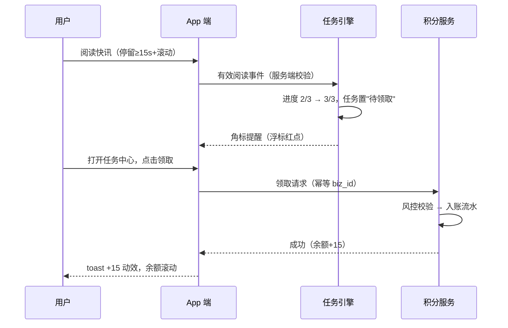

# Design：资讯板块优化迭代 · 产品设计说明

| 项 | 内容 |
|----|------|
| 关联 PRD | [prd.md](./prd.md) v0.9 |
| 作者 | 秦志洲 |
| 最后更新 | 2026-07-08 |
| 状态 | 待评审（与 prd.md 同场评审） |
| 设计稿 | Figma（设计部黄伟团队承接，本文档为设计输入；原型归档至 Axure 站点 /app/） |

---

## 1. 设计原则

1. **离交易近**：一切内容卡片提供直达个股页/下单的路径；资讯不是阅读器，是交易决策的前置站。
2. **可信优先**：AI 内容显性标识（用户一眼可辨），数字可溯源（点击见原文）；宁可降级不发，不发错。
3. **轻参与**：互动组件把发言成本压到"一次点击/一句话"；写长文不是本期用户的义务。
4. **激励可感**：积分获取当场反馈（toast+动效），账单可查，权益兑换三步内完成。
5. **克制推送**：新增内容类型不突破现有节流框架（60 分钟间隔/免打扰/合并推送），退订率是护栏指标。

## 2. 信息架构（IA）

```
App 底部 Tab：行情 | 资讯 | 交易 | 社区* | 我的        （*社区入口位置沿用现状，Phase 2 评估是否与资讯合并）
│
├── 资讯首页（D1 改版，Phase 2；Phase 1 在现结构上插卡）
│   ├── 顶部：AI 日报卡（盘前/盘后，常驻当日）＋「赚积分」浮标（任务中心入口）
│   ├── 要闻精选（编辑/打分加权）
│   ├── 快讯流（chip 筛选：全部 | 公告 | 7×24 | 虚拟资产）
│   ├── 话题横滑区（Phase 2：事件话题 + 打新讨论区）
│   └── 社区热帖混排（Phase 2：官方号/真人 UGC 按配比插入）
│
├── 个股页 › 资讯 Tab（强化）
│   ├── 财报速读卡（业绩期置顶 7 天）
│   ├── 异动解读卡（触发时展示，Phase 2）
│   ├── 公告子栏（摘要+外链原文）
│   └── 新闻子栏（标的关联聚合，A3-3）
│
├── 任务中心（新，半浮层页）
│   ├── 积分余额 + 今日已赚 + 「去兑换」
│   ├── 每日任务列表（进度条 + 领取按钮）
│   └── 成长任务 + 积分规则入口
│
├── 行情商城 › 积分兑换专区（新 Tab）
│   └── SKU 卡片（所需积分/库存/我的余额）→ 确认页 → 结果页
│
├── 社区（Phase 1 只做治理，Phase 2 上互动）
│   ├── feed（官方 AI 号数据帖 + 真人 UGC，配比受控）
│   ├── 快讯详情页底部：情绪按钮（利好/利空/看不懂）+ 闪评区
│   ├── 个股讨论区：多空 PK 投票 + 帖子流
│   └── 话题页：事件聚合（快讯+公告+UGC）＋风险提示条（风险股）
│
└── 我的 › 积分账户
    ├── 余额/即将过期提醒/收支明细（流水）
    └── 我的卡券（现有页，兑换所得在此）
```

## 3. 核心页面设计说明（线框级，Figma 前的设计输入）

### 3.1 AI 日报卡（资讯首页顶部）

- 折叠态：横幅卡，左侧「盘前参考 · 7月8日」+ 三条今日关注标题跑马；右上角「AI 生成」灰色标签。
- 展开态（点击进详情页）：章节化排版（隔夜市场/今日关注/公告雷达/新股与日历），每章节内的个股名可点击直达个股页；页尾固定免责声明五段式（合规版本）。
- 降级态：模板版仅展示行情数据表+要闻标题列表，顶部提示条"今日速览（数据版）"。
- 埋点：daily_report_view（stay_ms 从展开计时）。

### 3.2 公告快讯卡（快讯流内）

- 结构：类型角标（业绩=蓝/停复牌=红/回购=绿…）+ 中文标题 + 三行要点 + 底部「查看公告原文 ↗」（跳披露易/EDGAR）+ 尾注"内容由 AI 提取自公司公告，以原文为准"。
- 交互：点击标的名进个股页；长按弹出「加自选/分享/不感兴趣」。
- 边界态：低置信度公告 → 无要点，仅标题+外链（区别样式：无角标）。

### 3.3 任务中心（半浮层，从「赚积分」浮标唤起）

- 头部：积分余额（大数字）+ 今日已赚 +「去兑换」按钮；余额数字点击进积分明细。
- 任务列表项：任务名 + 积分值 + 进度（如 阅读 2/3）+ 按钮三态：去完成（跳转对应场景）/ 领取（高亮+领取后飞入余额动效）/ 已完成（灰）。
- 领取反馈：toast「+15 积分」+ 余额滚动动画——对应"获取可感"原则。
- 边界态：预算耗尽 → 按钮置灰"今日奖励已发完，明日恢复"；风控冻结 → 整页替换为提示态。

### 3.4 积分兑换专区（行情商城内新 Tab）

- SKU 卡：权益图 + 名称 + 所需积分（固定汇率，不做浮动价）+ 库存状态角标；不足时展示「还差 120 分，去做任务 →」。
- 确认页：权益说明/激活规则（沿用卡券现有说明）/ 地区版本自动匹配提示（港股 LV2 大陆版/非大陆版按账户合规地区展示，不可选）。
- 结果页：成功 → 卡券已放入「我的卡券」+「去行情页体验」；失败 → "积分已退回"+客服入口。

### 3.5 快讯详情 & 闪评（Phase 2）

- 详情页底部固定条：三个情绪按钮（利好 👍/利空 👎/看不懂 🤔，点击即计数并高亮）+ 输入框"说一句…（100 字内）"。
- 闪评区：按热度排序，折叠展示 3 条 +「展开」；每条带作者昵称/时间/点赞；官方 AI 号评论带蓝色「官方 AI」标签。
- 审核中态：自己可见自己的评论带"审核中"角标（先发后审用户不出现此态，命中转人审才出现）。

### 3.6 官方 AI 号（社区）

- 身份视觉：头像右下角 AI 角标 + 昵称后蓝色「官方 AI」标签（不可与个人认证混淆）+ 个人页置顶声明。
- 帖子形态：结构化数据卡（异动榜/回购榜/打新日历），图表化呈现，尾注 AI 标识+免责声明。

### 3.7 CMS 侧（运营/审核后台）

- 人审队列：待审列表（命中原因高亮、举报聚合数、剩余 SLA 倒计时）→ 详情（通过/驳回+原因模板/限流/下架）；操作全留痕。
- 应急面板：按话题/个股一键关评+限流；全量"先审后发"应急开关（Apollo 联动）。
- 积分运营：任务配置（分值/上限/开关）、预算池配置与消耗监控、SKU 上下架与库存、对账报表。
- 补录队列：低置信度公告/生成失败日报的人工处理入口。

## 4. 关键交互流程

### 4.1 阅读任务 → 积分到账



### 4.2 UGC 发布 → 审核 →（通过）积分

发布 → 机审（敏感词+模型）→ ①通过：即时可见（先发后审用户）→ ②命中：转人审（作者见"审核中"）→ 通过恢复曝光 / 驳回通知+申诉入口。审核通过的首 2 条/日在 T+1 发积分（防"发帖秒删薅分"）。异常路径与状态机见 prd.md 6.1。

### 4.3 兑换行情卡

选 SKU → 确认 → 冻结积分 → 调卡券发放（复用行情卡自动激活链路）→ 成功：冻结转消耗 + 卡券入账；失败/超时：对账任务 5 分钟内退分 + 通知。状态机见 prd.md 6.4。

## 5. 系统设计概要（产品视角，供 tech-design.md 输入）

### 5.1 能力分层与复用/新建

```mermaid
flowchart TD
    subgraph 采集层
        S1[披露易采集 新建]
        S2[EDGAR 采集 新建]
        S3[融聚客现有源 复用]
        S4[行情/日历/热股池 复用]
    end
    subgraph AI 加工层（复用资讯智能体+推送管线，扩展任务）
        A1[解析/要素抽取 复用]
        A2[生成:日报/速读/解读 新建任务]
        A3[翻译/摘要 扩展 t_ai_news_summary]
        A4[去重 前置到分发层 改造]
        A5[合规过滤+打分 复用]
    end
    subgraph 内容与分发层
        C1[t_news/CMS 扩展字段]
        C2[feed 服务 改造:混排+配比]
        C3[个股聚合 新建索引]
        C4[推送 复用:节流/免打扰+新增定向通道]
    end
    subgraph 社区与治理层
        U1[UGC 服务 改造:闪评/投票]
        U2[审核服务 新建:人审队列+状态机]
        U3[官方号内容任务 新建 XXL-Job]
    end
    subgraph 激励层（新建，接现有卡券）
        P1[积分账户/流水]
        P2[任务引擎]
        P3[兑换服务 → 卡券系统/行情商城]
    end
    采集层 --> AI加工层 --> 内容与分发层
    内容与分发层 --> 社区与治理层
    社区与治理层 --> 激励层
    内容与分发层 --> 激励层
```

### 5.2 与现有系统的集成点（研发评审重点核对）

| 集成点 | 现有系统 | 集成方式 |
|--------|----------|----------|
| 公告/AI 内容入库分发 | t_news → Kafka → AI 应用消费管线 | 新 source 入同一管线，新增 announcement 扩展字段；打分/节流/免打扰规则不变 |
| AI 总结与翻译 | t_ai_news_summary（多语种 JSON） | 扩展正文级翻译；语种沿用 zh_CN/zh_TW/en_US |
| 定向公告推送 | 个推 + notice_message_queue（RabbitMQ） | 新增"自选股公告"推送类别（app.category 新值），频控独立计数 |
| 选题依据 | t_hot_stock_pool（moomoo 热议榜爬取） | 官方号数据帖与话题运营直接读取 |
| 兑换权益 | 卡券系统（行情卡自动激活/免佣券/打新券）+ 行情商城 | 积分兑换服务调卡券发放接口；行情商城新增"积分"支付方式与专区 Tab；沿用库存预警、地区卡种、续订顺延规则 |
| 机审 | 阿里云敏感词库（资讯自动审核已用） | UGC 复用 + 叠加 AI 部内容合规模型；人审队列新建于 CMS |
| 配置 | Apollo（news.push.* 习惯） | 新增 points.*、ugc.audit.*、content.factory.* 配置族，全部功能开关化 |
| 埋点 | 神策 | 事件表见 prd.md 第 8 节，方案并入《数据采集方案》xlsx 维护（对接李兰线） |
| 监控 | 飞书 webhook 值班通道 | AI 生成失败/采集失败/人审积压/预算水位四类新告警 |

### 5.3 新增数据对象（概要，字段细节见 prd.md 5.7）

`t_ai_daily_report`（日报）、`t_points_account` / `t_points_txn`（积分账务，流水只增不改）、`t_task` / `t_task_progress`（任务）、`t_points_order`（兑换单）、`t_ugc_audit_log`（审核留痕）、t_news 扩展字段（announcement_*、extract_confidence、dup_of、related_stocks、event_topic_id）。

### 5.4 AI Agent 矩阵（与公司 AI 平台联动）

| Agent | 职责 | 承载平台 | 人工卡点 |
|-------|------|----------|----------|
| 公告采集 Agent | 披露易/EDGAR 轮询、解析、要素抽取 | 自研管线（复用资讯智能体） | 低置信度 → 人工补录队列 |
| 内容生成 Agent | 日报/速读/异动解读生成 | AI 应用（复用推送管线的 LLM 通道） | 数字回验失败 → 拦截转人工；上线首月 10%/日抽检 |
| 翻译 Agent | 简繁英正文级翻译 | 同上（扩展 t_ai_news_summary） | 失败降级原文 |
| 审核 Agent（机审） | 敏感词+财经言论模型初审 | 阿里云敏感词 + AI 部合规模型 | 命中 → 人审队列（运营） |
| 官方号内容 Agent | 数据帖模板渲染与定时发布 | XXL-Job + 模板引擎 | 数据完整性校验不过不发 |
| 运营辅助 Agent | 话题选题建议、竞品动态监控 | n8n（对齐 20-产品部工作流竞品监控）+ OpenClaw 飞书侧 | 运营终审后上线话题 |

> 对齐《99-统一 AI 平台架构》方向：以上生成/审核能力沉淀为平台侧可复用组件，后续可对客输出（AI 会员服务线）。

## 6. 多语言与端适配

- 文案三套（zh_CN/zh_TW/en_US）随版本齐备，AI 生成内容 zh_CN 先行、繁英走翻译管线 T+0 跟进（未就绪显示原文）。
- 端节奏：iOS/Android 同步发版；PC 端 Phase 1 仅同步资讯消费侧（日报/公告），任务与兑换 Phase 2 跟进；旧版本 App 版本门槛控制不显示新入口。
- 深色模式：全部新卡片提供深浅两套（对齐现有设计规范，MONO Sans Tabular 等宽数字字体沿用）。

## 7. 设计走查记录（设计走查 Agent · 逻辑一致性与遗漏检查）

> 对应工作流图"设计走查 Agent：检查逻辑一致性和遗漏"。以下为对 prd.md ↔ design.md 交叉走查结论，✅=已一致，🔧=走查中发现并已修正，⚠️=遗留待评审确认。

| # | 走查项 | 结论 |
|---|--------|------|
| 1 | PRD 功能地图 vs IA 覆盖：A1-A3、B1/B5、C1-C3 均有页面/后台承载 | ✅ |
| 2 | 每个有状态对象（内容/积分流水/兑换单）均有状态机且页面态与状态机对应（审核中/降级态/置灰态） | ✅ |
| 3 | 任务"领取"动作与积分幂等发放的 biz_id 约定在 PRD 5.7/5.8 与流程 4.1 一致 | ✅ |
| 4 | 🔧 发现：闪评积分 T+1 发放（防秒删薅分）最初只写在任务表格备注，已同步补进 4.2 流程与 PRD 5.8 验收标准 | 🔧 已修正 |
| 5 | 🔧 发现：行情卡地区版本（大陆/非大陆）在兑换流程中的自动匹配规则，PRD 5.9 已写，确认页设计稿需给"不可选"的明确提示样式 | 🔧 已在 3.4 补充 |
| 6 | AI 标识出现位置盘点：日报卡/详情、公告快讯尾注、官方号头像+昵称+主页、闪评区官方号评论——无遗漏场景 | ✅ |
| 7 | 未登录用户全链路：可浏览资讯/日报/话题，互动与任务触发登录引导；PRD 3.2 边缘场景已列 | ✅ |
| 8 | ⚠️ 社区 Tab 与资讯 Tab 的关系（合并 or 并存）影响 D1 信息架构，Phase 2 前需定论 | ⚠️ 列入评审议题 |
| 9 | ⚠️ 任务中心浮标对资讯首页视觉的干扰度（与运营弹窗/新股弹窗优先级关系：系统>新股>运营，浮标不属弹窗体系）需设计部评估 | ⚠️ 交设计评审 |
| 10 | 埋点事件与页面动作映射齐全（每个新页面/关键按钮均有对应事件） | ✅ |

## 8. 设计部对接清单（输出给 20-1 设计部工作流）

| 设计需求 | 优先级 | 参考 |
|----------|--------|------|
| AI 日报卡（折叠/展开/降级三态）+ 详情页排版 | P0 | 富途牛牛 AI 早报、长桥自选概括流 |
| 公告快讯卡视觉体系（类型角标色板） | P0 | — |
| 任务中心半浮层 + 积分动效（领取飞入） | P0 | 老虎虎币中心 |
| 兑换专区 SKU 卡与确认/结果页 | P0 | 行情商城现有风格延续 |
| 官方 AI 号身份视觉规范（角标/标签/主页声明） | P0 | 需与合规确认措辞后出稿 |
| 闪评条 + 情绪按钮 + 多空 PK 组件 | P1（Phase 2 版本前） | 雪球/老虎评论区 |
| 话题页模板（含风险提示条样式） | P1 | — |
