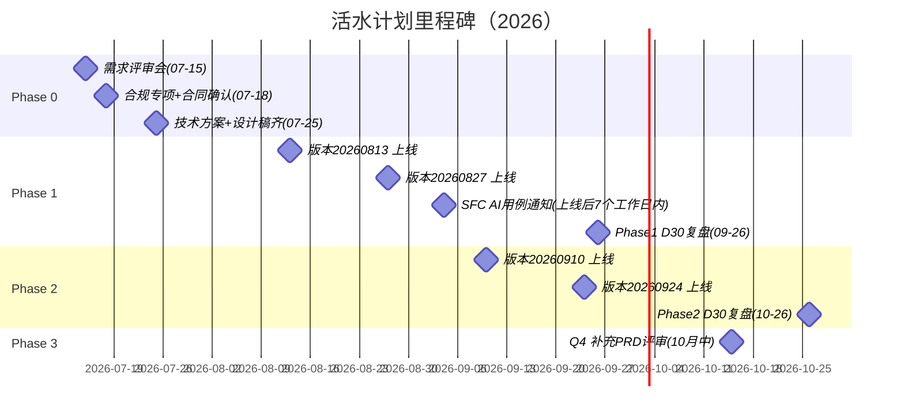

# Plan：资讯板块优化迭代 · 实施计划

| 项 | 内容 |
|----|------|
| 关联文档 | [prd.md](./prd.md) · [design.md](./design.md) · [tasks.md](./tasks.md) |
| 作者 | 秦志洲 |
| 最后更新 | 2026-07-08 |
| 版本节奏基准 | 公司 2026 双周迭代（版本号=上线日期）；20260702 在途、20260716/20260730 已排满，本项目自 **20260813** 起承载 |

---

## 1. 总体阶段划分

```
Phase 0  评审与就绪        2026-07-09 ~ 07-25（不占版本，评审+合规+基线+技术方案）
Phase 1  内容底座 + 积分MVP  版本 20260813 + 20260827
Phase 2  社区互动 + 兑换扩展  版本 20260910 + 20260924
Phase 3  生态化（创作者/入驻/推荐） Q4 版本（201015 起，另出补充 PRD）
观察复盘  每 Phase 上线后 D7/D30 数据复盘，决定下阶段放量与范围
```

**排期取舍说明**：Phase 1 先"内容+积分"、后"社区互动"（Phase 2），原因见 prd.md 决策记录——社区互动需要"有东西可评"，供给先行；同时 B1 机器人治理属合规风险项放最前。

## 2. Phase 0：评审与就绪（07-09 ~ 07-25，关键路径）

| 事项 | 产出 | 负责人（建议） | 截止 |
|------|------|----------------|------|
| 北极星基线取数（B₁-B₆） | 基线数据表，回填 PRD 2.2 | 秦志洲（神策取数） | 07-11 |
| PRD 需求评审会 | 评审纪要 + PRD v1.0 定稿 | 产品部召集；技术/运营/合规/AI 部与会 | 07-15 |
| 合规专项评审 | ①AI 内容标识与免责措辞 ②积分规则条款 ③UGC 管控标准 ④SFC AI 高风险用例流程与通知安排（上线后 7 个工作日内） | 合规部 + RO | 07-18 |
| 融聚客合同衍生权利确认 | 结论：媒体稿可否 AI 摘要/翻译（决定 A2/A3 范围） | 商务 + 合规 | 07-18 |
| 披露易接入方式确认 | 自建采集（摘要+外链模式）vs 供应商通道 结论 | 技术 + 合规 | 07-18 |
| 技术方案（tech-design.md） | 研发侧按 tasks.md 输出技术设计（Agent Teams 流程） | 后端/AI 部/端上负责人 | 07-22 |
| 权益预算与任务分值终值 | 预算池额度、SKU 定价、任务分值确认单 | 运营 + 财务 | 07-22 |
| 人审人力确认 | 审核编制与 SLA 承诺（30 分钟/交易时段） | 运营 | 07-22 |
| 设计稿（Phase 1 范围） | Figma 交付 + 设计走查 | 设计部（黄伟团队） | 07-25 |

> Phase 0 任何一项红灯（尤其合规两项）触发范围调整预案：见第 6 节。

## 3. Phase 1：内容底座 + 积分 MVP

### 版本 20260813（提测 ~08-04）

| 需求包 | 内容 | 端 |
|--------|------|-----|
| A1 公告快讯（港股披露易） | 采集/解析/快讯生成/公告 chip/个股页公告子栏/自选定向推送 | 后端+AI+iOS/Android |
| A3-1 去重治理 | 分发层去重 + CMS 解除去重操作 | 后端+CMS |
| B1 机器人治理（第一步） | 存量机器人停发+灌水帖下沉；官方 AI 号身份体系上线（快讯君先行） | 后端+CMS+端上 |
| C1 积分账户 | 账户/流水/对账/《积分规则》页 | 后端+端上 |
| B5 审核基线 | UGC 审核状态机与人审队列（为 Phase 2 UGC 铺路，先服务官方号内容与存量评论） | 后端+CMS |

### 版本 20260827（提测 ~08-18）

| 需求包 | 内容 | 端 |
|--------|------|-----|
| A2-1 AI 盘前/盘后日报 | 生成管线+首页日报卡+推送+降级模板 | AI+后端+端上 |
| A2-2 财报 AI 速读 | 业绩公告触发+个股页置顶卡（业绩季 8 月中旬开始，赶在高峰前） | AI+后端+端上 |
| A3-2 翻译 | 快讯全量+要闻 ≥8 分翻译，正文级 t_ai_news_summary 扩展 | AI+后端 |
| A3-3 标的标签 | related_stocks 落库+个股页新闻聚合 | AI+后端 |
| C2 任务体系 v1 | 任务中心+签到/阅读/互动任务+防刷 | 后端+端上 |
| C3-1 积分兑换行情卡 | 行情商城积分专区+3 个 SKU+卡券对接 | 后端+端上 |
| B1 官方号（第二步） | 数据君/打新君上线（数据帖模板） | AI+后端 |

**Phase 1 出口条件（Gate）**：公告快讯时效 P95≤5min 达标；AI 内容人工抽检准确率 ≥99%（数字类 100%）；积分对账连续 7 日零差异；无 S 级客诉。达标后 Phase 2 全速，否则 Phase 2 顺延一个版本并优先修复。

## 4. Phase 2：社区互动 + 兑换扩展（20260910 + 20260924）

| 需求包 | 版本 | 说明 |
|--------|------|------|
| B2 快讯闪评 + 情绪按钮 | 20260910 | 依赖 B5 审核链路（Phase 1 已就绪） |
| B2 多空 PK 投票（个股页） | 20260910 | — |
| A2-3 个股异动解读卡 | 20260910 | 依赖事件引擎粒度优化（AI 部并行推进中） |
| C3-2 兑换扩展（免佣券/打新券/抽奖） | 20260910 | 免佣券/打新券沿用卡券规则；抽奖概率公示 |
| B3 事件话题页 + 打新讨论区 | 20260924 | 话题需运营确认后上线；打新讨论区绑新股日历 |
| D1 资讯首页信息流改版（混排） | 20260924 | 官方号/UGC 配比 Apollo 可控 |
| PC 端任务与兑换跟进 | 20260924 | — |

**Phase 2 出口条件**：真人日均发帖 ≥200（含闪评/投票附言）；UGC 违规曝光率 ≤0.01%；人审 SLA 达标率 ≥95%。

## 5. Phase 3：生态化（Q4，届时出补充 PRD）

B4 创作者与种子用户计划（徽章/流量/线下探访为主，现金合规论证后置）→ A4 自媒体/KOL 入驻（转载授权协议模板由合规产出）→ D2 个性化推荐（对齐资讯智能体 Phase 4b 智能推荐，AIGC-aware）→ B2-3 持仓晒单（脱敏+防伪+风险提示）→ C4 积分等级。**进入条件**：Phase 2 出口指标达成且北极星 ≥ B₁×1.3。

## 6. 范围调整预案（Phase 0 红灯时）

| 红灯 | 预案 |
|------|------|
| 融聚客不允许衍生加工 | A2/A3 的 AI 加工范围收缩至"公告+自有数据"（EDGAR/披露易摘要/行情/日历），媒体稿仅原样展示——日报素材改为"标题引用+外链"，项目整体不停摆 |
| 披露易自建采集不获合规通过 | 港股公告走供应商通道评估（融聚客是否含披露易通道）；期间 EDGAR（公共领域）先行，美股公告快讯先上 |
| 积分预算未获批 | C3-1 缩为单 SKU（7 天港股 LV2）小库存试点，验证核销率后追加预算 |
| 人审人力不足 | Phase 2 UGC 功能整体后移一个版本；Phase 1 官方号内容不受影响（机审+数据校验为主） |

## 7. 资源与分工（建议，以排期会为准）

| 角色 | 建议对接 | 说明 |
|------|----------|------|
| 产品 | 秦志洲（总）；卡券/兑换与林惠子对齐；行情商城与余博对齐；CMS/埋点与李兰对齐 | 三个存量系统的产品 owner 均需评审签字 |
| 后端 | 康雅琪/李金辉线（业务）+ 喻辉线（活动/奖励通道复用评估） | 积分账务与卡券对接是重点 |
| AI 部 | 资讯智能体/推送管线维护方 | 日报/速读/解读生成任务与合规模型 |
| 端上 | iOS 尚凯琪/瞿忠、Android 彭祥林/刘伟、前端周泽原 | 双端同步、PC 分阶段 |
| 设计 | 黄伟团队 | 见 design.md 第 8 节清单 |
| 测试 | 张毅楠/黄海洋线 | 重点：积分账务幂等/对账、审核状态机、AI 内容降级路径 |
| 运营 | 审核编制 + 任务/预算配置 + 话题运营 | Phase 2 起话题日历周更 |
| 合规/RO | 四项合规评审 + SFC 通知执行 | 见 Phase 0 |

## 8. 里程碑总览



## 9. 灰度与数据回收

- **灰度**：每版本按用户尾号 5%→20%→50%→100%，每档 ≥3 个交易日；积分发放预算随灰度比例切片；AI 日报推送首周仅灰度用户。
- **回收节点**：上线 D7 出首份数据周报（供给量/时效/参与率/退订率/审核指标），D30 出复盘（对照 prd.md 2.2 指标表逐项判定），复盘会决定下 Phase 放量与范围。
- **止损线**：AI 内容重大事实错误（数字级）单周 ≥3 起 → 停发整改；推送退订率周环比 +30% → 推送策略回滚；积分单用户日均成本超预算模型 50% → 熔断并复核任务分值。

## 10. 计划风险（与 prd.md 第 10 节互补，偏执行侧）

| 风险 | 应对 |
|------|------|
| 20260813 版本与在途需求（结余宝/CRM 渠道转移等）抢研发资源 | 07-15 评审会即排期锁定；A1+C1 为最小不可拆包，其余可滑至 20260827 |
| 业绩季（8 月中）财报速读上线即大流量 | 速读覆盖范围 Apollo 配置化，首周仅恒指成分股，逐步放开 |
| 双周版本节奏下测试窗口紧 | 积分账务与审核状态机提前出接口用例（tasks.md 已含验收标准，Test Agent 可直接生成用例） |
| 多团队协作（产品四条线 owner） | 每周一次活水计划站会（15 分钟），飞书群 + n8n 自动同步数据日报 |
