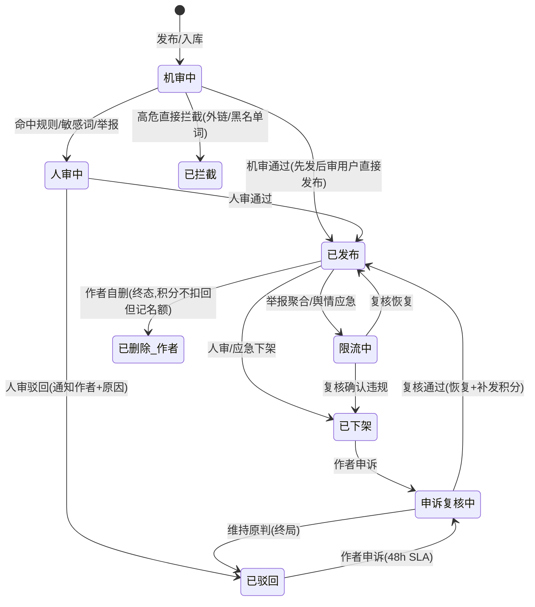
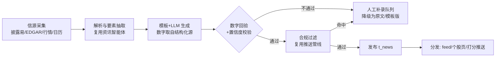

# PRD：资讯板块优化迭代（"活水计划"：内容供给 × 社区真人化 × 积分飞轮）

## 0. 文档信息

| 项 | 内容 |
|----|------|
| 产品/功能名称 | 资讯板块优化迭代 · 项目代号"活水计划" |
| 文档版本 | v1.0-rc（自查修订版，待评审会定稿 v1.0） |
| 作者 | 秦志洲（产品部 · 社区/AI 侧 PM） |
| 最后更新 | 2026-07-08 |
| 评审状态 | 草稿 → 待产品/技术/合规三方评审 |
| 相关文档 | [00-需求分析.md](./00-需求分析.md)、[design.md](./design.md)、[plan.md](./plan.md)、[tasks.md](./tasks.md)、[90-评审报告.md](./90-评审报告.md) |
| 背景资料 | 《资讯AI自动推送 技术文档》《资讯智能体_金融事件驱动》《运营产品工作交接》（阳湘 V1.0）、EPIC 需求池（积分体系原列 P2/P3） |

**修订记录**

| 版本 | 日期 | 修改人 | 修改内容 |
|------|------|--------|----------|
| v0.9 | 2026-07-08 | 秦志洲 | 初稿（需求分析三 Agent 调研 → PRD 生成） |
| v1.0-rc | 2026-07-08 | 秦志洲 | prd-review 自查修订：新增推送总量预算、任务日切时区（HKT）与任务状态机、销户积分处理、预算日切片规则、作者自删规则、核销率口径备注、Open Question #9；合规节补披露易版权模式与 SFC AI 通函要求（详见 90-评审报告.md） |

---

## 1. 背景与问题

### 1.1 业务背景

资讯板块是卓锐 App 上除行情、交易外用户停留时长最重要的模块，承担"让用户不交易时也打开 App"的留存职能。当前面临三个结构性问题：

**问题一：内容供给不足，且不会再买源。**
现有媒体源仅 5-9 家（经融聚客聚合采购：路透、金吾资讯、财华社、Blockbeat、techub 等），分类为快讯/要闻/虚拟资产/卓锐洞察。公司已明确**不再新增付费资讯采购**。对照富途（自建新闻团队+几十家源）、老虎、长桥，我们在内容条数、形态（专题/深度/视频）、时效上全面落后。同时存量内容还存在已登记的质量问题：内容重复、推送收不到（CMS 已知问题清单），资讯翻译、质量评估长期在"待开发"状态。

**问题二：社区几乎全是机器人发帖，真人含量近乎为零。**
社区内容以机器人 Agent 灌水为主，内容同质、无信息增量。用户一旦识别出"全是机器人"，对整个社区的信任即崩塌——机器人灌水不是中性的填充，是**负资产**。当前社区无创作者体系、无话题运营、无低门槛互动组件，真人既没有理由发帖，发了也没有人看。

**问题三：积分商城与资讯/社区无联动，激励无效。**
"阅读文章得积分"等玩法参与率低、用户无感。根因（详见 [00-需求分析.md](./00-需求分析.md) 用户调研）：① 积分能换的东西没价值感；② 获取无感知（无进度、无提醒）；③ 与看盘/交易核心场景无关。而公司实际上握有一副好牌没有打：**卡券体系已有行情卡（唯一支持自动激活）、免佣券、打新券、加息券等高感知权益，行情商城已上线**——积分体系本身也已在公司 EPIC 需求池中（原优先级 P2/P3），只是从未与资讯/社区打通。

### 1.2 不做会怎样

- 资讯板块沦为"行情 App 的附属摆设"，用户看资讯去富途/雪球，卓锐只剩交易通道价值，佣金价格战中无护城河；
- 机器人社区持续伤害品牌信任，且随内地监管与香港 SFC 对 AI 内容标识要求趋严，"机器人伪装真人发帖"存在合规暴露风险（AI 生成内容标识义务）；
- 积分商城维护成本持续投入但无产出，权益预算浪费。

### 1.3 本次迭代的核心思路（一句话）

**不买新的水，把现有的水盘活**：用已落地的 AI 管线对"存量付费内容 + 零成本公开信源"做深加工，把内容供给做厚（问题一）；把机器人从"伪装真人灌水"收编为"明确标识的官方数据助手"，同时用低门槛 UGC 组件 + 话题运营给真人创造发言理由（问题二）；把积分体系提级立项，接通已有卡券/行情商城权益，形成"看资讯/发帖 → 得积分 → 换行情卡/免佣券 → 更高频看盘交易"的飞轮（问题三）。

### 1.4 可复用的存量资产（这是方案成立的前提）

| 存量资产 | 现状 | 本项目如何复用 |
|----------|------|----------------|
| 资讯 AI 自动推送管线 | 已落地：t_news→Kafka→合规过滤→热股分→AI 打分（阈值15）→去重→节流→推送 | 扩展消费端：新增内容类型（公告快讯、AI 日报）直接入管线 |
| 资讯智能体（事件驱动） | 已完成要素抽取（股票/行业/指数/情绪）、事件抽取与识别；社区内容标的抽取已完成 | 标的关联、事件话题聚合、异动解读的底层能力 |
| t_ai_news_summary | AI 总结多语种（zh_CN/en_US/zh_TW）已建 | 资讯翻译/摘要直接扩展此表 |
| t_hot_stock_pool 热股池 | 每日爬 moomoo 热议榜，hotness 0-100 | 话题运营选题、异动解读选股依据 |
| 卡券系统 | 行情卡/免佣券/现金券/打新券/加息券，发放接口齐备 | 积分兑换的权益供给，不新建权益 |
| 行情商城 | 已上线，LV2 行情卡等商品在售 | 增加"积分兑换"支付方式 |
| 运营活动系统（奖励方案） | 任务类型：注册/开户/入金/转仓/交易/邀请 | 任务引擎参考其模型，积分任务独立建设并预留打通 |
| 阿里云敏感词机审 + 香港人工内审机制 | 资讯自动审核已用；视频有人审流程 | UGC 审核复用机审能力，人审队列新建 |
| 神策埋点 | 已埋注册/登录/开户/入金漏斗 | 本项目全部事件走神策，基线与验收取数口径统一 |

---

## 2. 目标与非目标

### 2.1 业务目标

1. 在**零新增内容采购预算**下，将日均可消费内容条数提升一个数量级，建立"公告+快讯+AI 衍生内容+UGC"四层内容供给结构；
2. 社区从"机器人灌水"切换为"官方 AI 号（明确标识）+ 真人 UGC"的健康结构，跑通真人内容冷启动；
3. 积分体系与资讯/社区/卡券打通，验证"内容消费—积分—权益—交易"飞轮，为 Q4 全量积分体系（EPIC 提级）提供数据依据。

### 2.2 成功指标

> 基线值上线前从神策取数补齐（负责人：秦志洲，评审前完成；下表"现状"列暂以 B 表示基线）。指标口径详见第 8 节埋点。

| 指标 | 类型 | 现状 | 目标（上线后 3 个月） | 统计口径 | 观测周期 |
|------|------|------|------|----------|----------|
| 资讯周活跃渗透率 | **北极星** | B₁（待补） | ≥ B₁ × 1.5，且不低于 30% | 周内有效消费≥1 条内容（阅读≥15s 或播放≥10s）的登录用户 / 周登录用户 | 周 |
| 日均可消费内容条数 | 供给 | B₂ ≈ 现源日均条数 | ≥ B₂ × 8（公告快讯+AI 衍生贡献为主） | CMS 当日"已发布"状态内容条数（去重后） | 日 |
| 人均单日有效阅读条数 | 消费 | B₃ | ≥ B₃ × 1.3 | 有效阅读事件数 / 资讯 DAU | 周 |
| 真人日均发帖量（含闪评/投票） | 社区供给 | ≈ 0 | ≥ 200 条/日（Phase 2 末） | 非官方号、审核通过的 UGC 条数 | 日 |
| 真人 UGC 在社区 feed 曝光占比 | 社区结构 | ≈ 0 | ≥ 40%（Phase 3 末） | 真人内容曝光 PV / 社区 feed 总曝光 PV | 周 |
| 积分任务日参与率 | 激励 | B₄（现积分玩法参与率） | ≥ 25%（DAU 口径） | 当日完成≥1 个积分任务的用户 / DAU | 日 |
| 积分兑换核销率 | 激励有效性 | B₅ | ≥ 60% | 兑换权益 30 日内被激活使用的比例 | 月 |
| 完成积分任务用户的次 7 日留存 | 北极星护栏 | B₆ | 对照组 +5pct 以上 | 神策分群对比 | 周 |

**护栏指标（不允许恶化）**：交易客诉率、内容违规曝光率（违规内容曝光 PV/总 PV ≤ 0.01%）、推送退订率（月退订 ≤ 基线 +10%）、审核积压（人审队列 > 200 条告警）。

### 2.3 非目标（本期明确不做）

| 不做 | 原因 |
|------|------|
| 新增付费资讯源采购 | 公司预算约束（本 PRD 的前提） |
| 自建新闻采编团队 | 香港持牌机构自营媒体内容涉及额外合规成本，ROI 不成立 |
| 直播、语音房 | 供给与监管成本高，待社区真人活跃验证后再评估 |
| 私信/聊天 | 防骚扰与反洗钱（场外引流）风控成本高，本期不开 |
| 关注关系链与个人主页改版 | Phase 3 后视真人内容量决定，避免"有关系链没内容" |
| 积分现金提现、积分转赠 | 合规红线（避免构成储值/证券属性），永久不做方向 |
| 创作者现金分成 | 涉及无牌投顾激励风险，需合规专项论证后另立项 |
| A 股资讯专区 | 大陆存量客户政策敏感（2024-06 起境内下架），维持现状 |

### 2.4 假设与依赖

| 假设/依赖 | 说明 | 状态 |
|-----------|------|------|
| 融聚客合同允许对已购内容做 AI 摘要/翻译等衍生加工并在 App 内展示 | **本方案 A2/A3 的法律前提** | ⚠️ 待商务+合规确认（Open Question #1） |
| 港交所披露易、SEC EDGAR 公告数据可合规抓取/接入用于商业展示 | 公告为法定公开信息，但需遵守其使用条款与频率限制 | ⚠️ 待合规确认接入方式（自建采集 vs 经融聚客通道） |
| AI 部管线有余量支持新增内容类型 | 复用资讯智能体与推送管线，新增早晚报/解读生成任务 | 需 AI 部评审确认 |
| 卡券发放接口可供积分服务调用 | 行情卡自动激活链路已有 | 需后端评审确认 |
| 人审人力 | UGC 先发后审 + 命中转人审，预估日人审量 < 500 条，运营现有编制可承接 | 待运营确认 |

---

## 3. 用户与场景

### 3.1 目标用户

| 画像 | 特征 | 对资讯板块的 JTBD（雇佣它来干什么） | 当前痛点 |
|------|------|------|----------|
| P1 决策依赖型散户（核心） | 持仓港美股，每日看盘，交易频次中高 | "开盘前 5 分钟告诉我昨晚发生了什么、我的持仓有什么消息、今天该注意什么" | 源少更新慢；持仓相关消息淹没在通用要闻里；英文源看不懂 |
| P2 潜水浏览型 | 低频交易，碎片时间刷 App | "给我一条不断更新、和股票相关、划得下去的信息流" | 内容量撑不起 feed；社区全是机器人水帖，划两屏就到底 |
| P3 权益敏感型（羊毛型） | 对费用敏感，行情卡/免佣券到期就流失 | "让我用时间/活跃换到真金白银的权益" | 积分换的东西没价值；获取无感知；不知道积分能干嘛 |

### 3.2 核心使用场景（用户故事）

- **S1 盘前速览（主场景）**：作为持仓用户（P1），我想在 08:30 打开 App 时看到一份 AI 盘前早报（隔夜美股+今日港股关注点+我的自选股公告摘要），以便 3 分钟完成开盘准备。
- **S2 持仓公告即时知道（主场景）**：作为持仓用户（P1），我的自选/持仓股发布业绩、回购、配售等公告时，我想在个股页和推送中第一时间看到**中文结构化摘要**，以便判断是否操作。
- **S3 异动找原因（主场景）**：作为看盘用户（P1/P2），个股盘中异动（±5% 等）时，我想点开就看到"发生了什么"的 AI 解读卡片，以便不用去别的 App 搜新闻。
- **S4 一句话表达观点（次场景）**：作为普通用户（P2），我想在快讯下面点"利好/利空"、在多空 PK 里投一票、顺手发一句闪评，以便低成本参与讨论而不用写长文。
- **S5 攒分换行情卡（次场景）**：作为权益敏感用户（P3），我想通过每日签到、阅读、发帖攒积分，月底换一张 LV2 行情卡或免佣券，以便省下真金白银。
- **S6 打新讨论（次场景）**：作为打新用户，我想在新股认购期进入该新股的话题页，看到招股要点（AI 生成）和其他用户的讨论，以便决定是否认购、用现金还是融资。
- **边缘场景**：未登录用户（可看不可互动）、大陆 IP 存量用户（内容与活动可见性受合规规则约束）、纯英文/繁体用户（多语言）。

---

## 4. 需求概览

### 4.1 功能地图

```
活水计划
├── A 内容供给增强（0 采购成本）
│   ├── A1 公告快讯源接入（披露易/EDGAR → 结构化公告快讯）
│   ├── A2 AI 内容工厂（盘前/盘后日报、财报速读、异动解读、打新周历）
│   ├── A3 存量内容深加工（翻译、去重治理、标的/主题标签）
│   └── A4 自媒体/PUGC 入驻（转载授权，Phase 3）
├── B 社区真人化
│   ├── B1 机器人号治理（收编为官方 AI 助手号，明确标识）
│   ├── B2 低门槛 UGC 组件（快讯闪评、多空 PK 投票、晒单卡片）
│   ├── B3 话题体系（事件话题页、话题日历、打新讨论区）
│   ├── B4 创作者与种子用户计划（Phase 3）
│   └── B5 UGC 审核与治理（机审+人审闭环、举报、处罚）
├── C 积分联动（EPIC"积分体系"提级的 MVP）
│   ├── C1 积分账户与账务
│   ├── C2 任务体系（每日任务/成长任务，防刷）
│   └── C3 积分兑换（对接卡券：行情卡/免佣券/打新券 + 抽奖）
└── D 消费体验
    ├── D1 资讯首页信息流改版（要闻/快讯/AI 日报/话题/UGC 混排）
    └── D2 个性化推荐（AIGC-aware，Phase 3 起步）
```

### 4.2 需求优先级（MoSCoW）

| # | 需求 | 优先级 | 阶段 | 说明 |
|---|------|--------|------|------|
| A1 | 公告快讯源接入（港股披露易先行，美股 EDGAR 次之） | Must | P1 | 供给量与时效的最大杠杆，法定公开信息零采购成本 |
| A2-1 | AI 盘前/盘后日报 | Must | P1 | 主场景 S1，日更锚点内容 |
| A2-2 | 财报 AI 速读 | Must | P1 | 业绩季刚需，基于公告原文自产 |
| A3-1 | 资讯去重治理 | Must | P1 | 已知线上问题，供给量提升后重复会放大 |
| A3-2 | 资讯翻译（简/繁/英） | Must | P1 | CMS 待开发项，扩展 t_ai_news_summary |
| A3-3 | 标的关联与主题标签 | Must | P1 | 个股页聚合与话题页的地基（复用资讯智能体要素抽取） |
| B1 | 机器人号治理（官方 AI 助手号） | Must | P1 | 合规风险项 + 信任修复前提，先于真人运营 |
| B5 | UGC 审核与治理闭环 | Must | P1 | 一切 UGC 功能的前置合规条件 |
| C1 | 积分账户与账务 | Must | P1 | 积分一切玩法的地基 |
| C2 | 任务体系 v1（签到/阅读/互动） | Must | P1 | 飞轮的"得积分"环节 |
| C3-1 | 积分兑换行情卡（LV2） | Must | P1 | 飞轮的"花积分"环节，权益感知最强 |
| A2-3 | 个股异动 AI 解读卡片 | Should | P2 | 主场景 S3；依赖事件引擎粒度优化 |
| B2 | 快讯闪评 + 多空 PK 投票 | Should | P2 | 真人互动的最低门槛形态 |
| B3 | 事件话题页 + 打新讨论区 | Should | P2 | 场景 S6；聚合已有事件抽取能力 |
| C3-2 | 兑换扩展：免佣券/打新券/积分抽奖 | Should | P2 | 权益梯度补全 |
| D1 | 资讯首页信息流改版 | Should | P2 | 承载混排内容结构 |
| B2-3 | 持仓晒单卡片（脱敏） | Could | P3 | 防伪与合规设计成本高，后置 |
| B4 | 创作者计划 + 种子用户运营 | Could | P3 | 需先有 B2/B3 的互动土壤 |
| A4 | 自媒体入驻（转载授权模式） | Could | P3 | 0 现金成本换供给，需内容合作流程 |
| D2 | 个性化推荐 feed | Could | P3 | 对齐资讯智能体 Phase 4b 智能推荐 |
| C4 | 积分等级体系 | Won't（本期） | - | 数据积累不足，字段预留（见 C1） |
| — | 私信/直播/关注链改版/现金分成 | Won't（本期) | - | 见 2.3 非目标 |

---

## 5. 功能详细规格

> P0（Must）功能给全量规格（正常流+异常边界+规则+字段状态+验收）；Should 给规格概要+关键规则；Could 只在第 4 节列出，Phase 3 前出补充 PRD。

### 5.1 A1 公告快讯源接入

- **功能描述**：接入港交所披露易（先行）与 SEC EDGAR（次期）的上市公司公告，经 AI 结构化处理后生成"公告快讯"，进入现有资讯管线（快讯流、个股页、推送打分）。
- **入口/触发**：快讯 tab（新增"公告"筛选 chip）；个股页-资讯 tab-公告子栏；自选股公告推送；AI 日报引用。
- **正常流程**：
  1. 采集服务按频率轮询披露易新公告索引（交易时段每 1 分钟，非交易时段每 10 分钟）；
  2. 下载公告 PDF/HTML → 解析（复用资讯智能体 Phase 1 文档解析能力）→ 抽取要素：公告类型、标的、关键数字；
  3. 按公告类型模板生成中文快讯（标题+三行要点+**外链披露易原文**），写入 t_news（新 source 标识 `HKEX_DISCLOSURE`）。**版权模式约束：港股公告 App 内不承载全文、不整档转载，仅摘要+跳转披露易原文页**（披露易公告版权属发行人及 HKEX，"标题+摘要+外链"为低风险通行模式；整档转发需经 HKEX 资讯服务或持牌供应商授权，接入方式见 Open Question #2）。美股 EDGAR 申报文件属美国公共领域，可全文加工展示（注明来源，遵守 ~10 请求/秒限速与 UA 声明）；
  4. 入现有管线：合规过滤 → 标的关联 → AI 打分 → 达到推送线（15 分）走推送；未达线仅入流；
  5. 用户自选/持仓股的高量级公告（量级≥7：业绩、并购、停复牌、大比例回购/配售）触发**自选股定向推送**（独立于全局打分推送，走个股订阅通道）。
- **公告类型与处理优先级**（MVP 覆盖，按散户价值排序）：业绩公告（盈喜/盈警/中期/年度）＞ 停复牌 ＞ 回购/增减持 ＞ 配售/供股 ＞ 并购重组 ＞ 分红派息 ＞ 其他（其他类型仅入公告列表不生成快讯）。
- **异常与边界**：
  - 披露易访问失败/限频：指数退避重试（1/5/15 分钟），连续 3 次失败飞书告警值班群；期间公告列表展示缓存数据+「更新于 HH:MM」时间戳；
  - PDF 解析失败或要素置信度低于阈值：不生成快讯，降级为「原文公告」条目（仅标题+链接），进入人工补录队列；**禁止低置信度内容自动发布**；
  - 关键数字抽取错误风险：金额/百分比类字段展示时附「点击查看原文」，快讯尾部固定注明"内容由 AI 提取自公司公告，以原文为准"；
  - 同一事件多语言公告（中英文版）：按标的+公告编号去重，优先取中文版；
  - 非交易时段公告洪峰（港股 16:30-23:00 为公告高峰）：生成不限流，推送遵守现有节流规则（60 分钟间隔+免打扰 0-7 点静默入消息中心）。
- **规则与逻辑**：
  - 时效 SLA：披露易发布 → App 快讯可见，P95 ≤ 5 分钟（交易时段）；
  - 自选股定向推送频控：单用户单日公告推送 ≤ 5 条，超出合并为一条聚合推送（"你关注的 N 只股票发布了公告"）；
  - 大陆 IP 存量用户：公告快讯正常展示（属客观信息披露），但遵守现有推送前置过滤规则（政治敏感等过滤逻辑复用）。
- **字段与状态**：t_news 增补字段：`announcement_type`（枚举）、`announcement_no`、`source_url`、`extract_confidence`（0-1）、`is_directional_push`（是否触发定向推送）。内容状态机复用第 6.1 节。
- **交互与文案**：公告快讯卡片=类型角标（业绩/回购/停复牌…）+标题+三行要点+「查看原文」；空态："暂无公告，市场安静得很"；加载失败："公告加载失败，下拉重试"。
- **验收标准（Given-When-Then）**：
  - Given 披露易发布某港股盈喜公告，When 交易时段内，Then 5 分钟内（P95）快讯流出现该公告中文快讯，含类型角标与原文链接。
  - Given 用户自选了该股票且开启推送，When 公告量级≥7，Then 用户收到定向推送，点击落地到公告详情。
  - Given 公告 PDF 解析置信度 < 0.8，When 管线处理完成，Then 不生成 AI 快讯，公告列表仅展示原文条目，且该条进入 CMS 人工补录队列。
  - Given 用户当日已收到 5 条公告推送，When 第 6 条自选股公告产生，Then 不再单独推送，合并进聚合推送。
  - Given 披露易连续 3 次抓取失败，When 故障持续，Then 飞书值班群收到告警，App 端公告列表展示缓存+时间戳，无报错弹窗。

### 5.2 A2-1 AI 盘前/盘后日报

- **功能描述**：每个交易日自动生成《卓锐盘前参考》（港股开盘前）与《美股盘后速览》（美股收盘后），聚合隔夜行情、要闻 Top、公告精选、今日日历，以固定卡片位呈现在资讯首页顶部。
- **入口/触发**：资讯首页顶部日报卡片（当日常驻）；订阅用户 08:30 推送（盘前）/ 美股收盘后 30 分钟内推送（盘后）；历史日报可在专栏页回看。
- **正常流程**：
  1. 定时任务（XXL-Job）触发：盘前报 T 日 08:00 生成、08:20 前完成审核发布；盘后报美股收盘后 20 分钟生成；
  2. 素材来源（全部为站内已有数据，无版权增量）：隔夜美股/港股 ADR 行情（自有行情）、过去 12 小时打分 ≥ 10 的要闻标题池、A1 公告精选（量级≥7）、当日宏观日历与新股日历（自有结构化数据）、热股池 Top5；
  3. 按固定模板生成（章节：隔夜市场 / 今日关注 / 公告雷达 / 新股与日历），LLM 仅做"摘要与串联"，**所有数字直接取自行情/结构化数据源，不允许 LLM 生成数字**；
  4. 合规过滤（复用推送管线合规过滤）→ 发布前规则校验（见异常）→ 发布 + 推送。
- **异常与边界**：
  - 生成失败/超时（08:20 仍未产出）：自动降级为"模板版日报"（纯行情数据+要闻标题列表，无 AI 串联文案），同时飞书告警；**日报位不允许开天窗**；
  - 数字校验：生成文本中的涨跌幅/指数点位与源数据比对，偏差 > 0.1% 整篇拦截转人工；
  - 休市日（港股假期）：不生成盘前报，卡片展示上一交易日盘后报+「今日休市」角标；
  - 重大突发（如熔断、战争级事件）：日报不追热点，快讯与推送管线负责时效；日报生成失败不重试超过 2 次。
- **规则与逻辑**：AI 生成内容标识（卡片与详情页固定标注"本内容由 AI 生成，不构成投资建议"）；免责声明固定尾注；多语言：zh_CN 先行，zh_TW/en_US 经翻译管线 T+0 跟进。
- **字段与状态**：新表 `t_ai_daily_report`：report_id、type（PRE_MARKET/POST_MARKET）、trade_date、content_json（分章节）、status（生成中/待校验/已发布/降级发布/生成失败）、push_status。
- **验收标准**：
  - Given 正常交易日，When 08:30，Then 资讯首页顶部展示当日盘前报卡片，推送送达订阅用户，全文含 AI 标识与免责声明。
  - Given LLM 生成的恒指点位与行情源偏差 > 0.1%，When 发布前校验，Then 整篇拦截、转人工、告警，且 08:30 前发布降级模板版。
  - Given 港股休市日 08:30，When 用户打开资讯首页，Then 展示上一交易日盘后报 + 休市角标，无空白位。

### 5.3 A2-2 财报 AI 速读

- **功能描述**：港美股财报（业绩公告）发布后，自动生成"3 分钟速读"卡片：核心财务数字表（营收/净利/毛利率/同比）+ 业绩要点 + 管理层展望摘录，挂载在个股页与该公告详情页。
- **入口/触发**：A1 公告管线识别 `announcement_type=业绩` 时自动触发；个股页资讯 tab 置顶 7 天；自选股用户定向推送（复用 A1 定向推送与频控）。
- **正常流程**：公告原文 → 财务数据表抽取（结构化）→ 与上期/去年同期对比计算（计算在代码层完成，非 LLM）→ 要点与展望摘录生成 → 数字回验（抽取值与生成文案一致性校验）→ 发布。
- **异常与边界**：非标准格式财报（图片型 PDF）：OCR 置信度不足则不生成速读，仅展示原文；亏损/盈警类财报：文案禁用主观判断词（"暴雷""崩盘"），仅陈述数字与事实；美股财报英文原文：先抽数（数字无语言问题），文字要点走翻译管线。
- **规则与逻辑**：覆盖范围 MVP=恒生综指成分股+自选人数 Top500 港股+美股中概 Top100+自选 Top200 美股（配置化，Apollo）；其余股票仅展示原文公告。AI 标识与免责声明同 5.2。
- **验收标准**：
  - Given 覆盖范围内个股发布业绩公告，When 公告发布后 15 分钟内（P95），Then 个股页出现速读卡片，财务数字与公告原文一致（抽检 30 份 100% 一致为验收线）。
  - Given 速读财务数字抽取与原文不一致（回验失败），When 发布前，Then 拦截并转人工补录，不发布错误数字。

### 5.4 A3 存量内容深加工（去重 / 翻译 / 标签）

- **功能描述**：修复与增强存量资讯管线三件事：① 相似内容去重（现有已知问题）；② 全量要闻/快讯的简繁英翻译；③ 标的与主题标签化（每条资讯关联个股/行业/主题事件）。
- **正常流程**：
  - 去重：入库时计算文本向量相似度，同源 24h 内相似度 > 0.92 判重 → 仅保留首条，后续条目标记 `dup_of` 不再分发（AI 推送管线已有"近 3 天 AI 去重"，本项将去重前置到 feed 分发层，双层去重）；
  - 翻译：扩展 t_ai_news_summary 多语种能力至正文级，快讯全量、要闻按打分 ≥ 8 翻译，用户语言设置决定展示语种，未翻译完成时展示原文+「查看中文」入口置灰；
  - 标签：复用资讯智能体要素抽取，每条内容落 `related_stocks[]`、`industry[]`、`event_topic_id`，供个股页聚合（S2）、话题页（B3）、后续推荐（D2）使用。
- **异常与边界**：去重误判（不同事件相似文本）：保留人工"解除去重"操作（CMS）；翻译失败：展示原文不阻塞发布；标签抽取失败：内容正常发布，仅不进个股聚合。
- **规则与逻辑**：翻译成本控制：快讯 ≤ 500 字全量，要闻超长文只译标题+摘要（详情页提供"AI 翻译全文"按钮按需触发）。
- **验收标准**：
  - Given 同一事件两家源先后入库（相似度>0.92），When 用户刷新 feed，Then 只出现一条，第二条在 CMS 标记 dup_of 可查。
  - Given 用户语言为繁体，When 打开任一快讯，Then 展示 zh_TW 版本；翻译未就绪时展示原文且不报错。
  - Given 一条路透个股新闻入库，When 要素抽取完成，Then 该股个股页-资讯 tab 可见此条（P95 延迟 ≤ 2 分钟）。

### 5.5 B1 机器人号治理（官方 AI 助手号体系）

- **功能描述**：下线现有全部"伪装真人"的机器人发帖账号；收编为 3 个**明确标识的官方 AI 助手号**：`卓锐快讯君`（盘面/要闻联动）、`卓锐数据君`（异动榜/大宗/回购数据帖）、`卓锐打新君`（新股日历/招股要点/暗盘提醒）。官方号内容全部由结构化数据模板生成，带「官方 AI」蓝色标识，不参与积分激励，不允许被誤认为真人。
- **入口/触发**：社区 feed、话题页、个股讨论区。
- **正常流程**：
  1. 存量机器人账号处理：T 日起停止新发帖 → 历史灌水帖分批下沉（不删除、不再进 feed 分发，7 日内完成）→ 账号注销或转为官方号；
  2. 官方号发帖：XXL-Job 定时 + 事件触发（如异动、新股开始认购）→ 数据模板渲染 → 合规过滤 → 自动发布；
  3. 每个官方号有发帖节奏上限（见规则），避免官方内容淹没真人内容。
- **异常与边界**：数据源异常时官方号**宁可不发不发错**（数据帖发布前校验数据完整性）；官方号内容被举报：进人审队列同普通内容，可下架；feed 混排时官方号内容占比硬上限（见规则）。
- **规则与逻辑**：
  - 身份标识：头像角标 + 昵称后「官方 AI」标签 + 个人页声明"本账号内容由 AI 基于公开数据自动生成，不构成投资建议"——满足 AI 生成内容标识要求［合规确认后措辞定稿］；
  - 发帖频率：单官方号 ≤ 12 帖/日；社区 feed 中官方号内容曝光占比 ≤ 50%（Phase 2 起逐步下调至 30%，随真人供给爬坡）；
  - 官方号内容不计入"真人日均发帖量"指标（防指标造假）。
- **验收标准**：
  - Given 治理完成后，When 抽查社区 feed 任意 100 条，Then 无未标识的机器人内容；官方号内容均带「官方 AI」标识。
  - Given 异动数据源当日故障，When 数据君定时任务触发，Then 该帖不发布且飞书告警，社区无错误数据帖。
  - Given feed 官方号内容占比达 50%，When 官方号继续发帖，Then 新帖仅入官方号主页不进 feed 分发。

### 5.6 B5 UGC 审核与治理

- **功能描述**：为全部 UGC（闪评/投票附言/帖子/评论）建立"机审+人审"闭环，覆盖财经言论合规（荐股/喊单/保证收益/非法投顾）、通用违规（涉政/色情/广告导流/诈骗）、举报与处罚。
- **审核策略**（分层）：
  | 内容/用户类型 | 策略 |
  |---|---|
  | 新注册 < 7 天 或 历史违规 ≥ 2 次用户 | **先审后发**（机审通过即发，命中即压 → 人审） |
  | 普通用户常规内容 | **先发后审**（机审实时，命中转人审并即时限流） |
  | 含外链/二维码/联系方式 | 一律拦截（社区不允许外链，白名单域名除外） |
  | 财经高危词（"必涨""满仓干""带你赚""内幕"等） | 机审拦截 → 人审；二次违规账号禁言 |
- **正常流程**：发布 → 敏感词+模型机审（复用阿里云敏感词库 + AI 部内容合规模型）→ 通过即发布/命中转人审 → 人审通过/驳回（通知作者+原因）→ 作者可申诉 → 复核（升级审核员）→ 终局。举报：任意用户可举报（分类：荐股诈骗/广告/人身攻击/谣言/其他）→ 举报聚合进人审队列（同内容 ≥ 3 人举报优先级提升）→ 处理结果通知举报人。
- **异常与边界**：人审队列积压 > 200 条：告警并自动收紧为"先审后发"全量模式（应急开关，Apollo 配置）；误伤申诉：48h 内响应，复核通过的内容恢复曝光并补发积分；突发舆情（如某股暴雷引发群体激烈言论）：CMS 支持按话题/个股一键"关评+限流"应急操作，操作留痕。
- **规则与逻辑**：
  - 人审 SLA：交易时段命中内容 ≤ 30 分钟，非交易时段 ≤ 2 小时；
  - 处罚分级：删帖警告 → 禁言 24h → 禁言 7 天 → 永久禁言（累犯递进，可申诉）；处罚同步扣回对应内容已发积分；
  - 全链路留痕：内容、机审结果、人审操作、申诉、处罚全量入审计日志，保存 ≥ 7 年（对齐 SFC 记录保存惯例，具体年限合规确认）。
- **验收标准**：
  - Given 用户发布含"明天必涨，满仓干"的评论，When 提交，Then 机审拦截转人审，内容不出现在任何 feed，用户端显示"内容审核中"。
  - Given 人审驳回，When 作者查看，Then 收到通知含驳回原因与申诉入口；申诉后 48h 内有复核结论。
  - Given 同一帖被 3 个不同用户举报，When 第 3 次举报提交，Then 该帖在人审队列置顶且立即限流（不再新增曝光）。
  - Given 人审队列 > 200 条，When 新 UGC 发布，Then 全量切换先审后发，飞书告警运营群。

### 5.7 C1 积分账户与账务

- **功能描述**：为每个卓锐号建立积分账户，支持积分的发放、消耗、冻结、过期、冲正，账务可对账可审计。这是 EPIC"积分体系"的地基，本期按 MVP 建设但表结构按全量设计。
- **规则与逻辑**：
  - 积分定位（合规红线）：积分为**平台运营激励**，不可兑换现金、不可转赠、不可交易，不构成任何证券/存款/储值；兑换仅限平台权益（卡券/虚拟权益/实物礼品）；条款写入《积分规则》页并经合规审核；
  - 有效期：滚动 12 个月（当月获得的积分于次年当月月末过期），先进先出消耗；过期前 30 天站内信提醒；
  - 上限与熔断：单用户单日获取上限 200 分（任务体系内配置）；平台月度积分发放总额预算池（运营在 CMS 配置），达 90% 飞书预警、100% 自动停发；**日切片规则**：当日额度 = 月剩余预算 ÷ 当月剩余天数，当日未用完自动滚存次日（避免月底断崖也避免月初挤兑）；
  - 销户处理：用户发起销户时，销户确认页提示"积分余额 X 分将作废且不予折现"，销户完成后积分账户注销、余额清零（生成 EXPIRE 流水），流水按审计要求留存；
  - 负向操作：违规内容扣回积分、兑换失败退回积分，均生成冲正流水，账户余额不允许为负（扣回超出余额时扣至 0 并记录欠账标记）。
- **字段与状态**：
  - `t_points_account`：user_id、balance、frozen、total_earned、total_spent、level（预留）、status（正常/冻结）；
  - `t_points_txn` 流水：txn_id、user_id、type（EARN/SPEND/EXPIRE/REVERSE/FREEZE/UNFREEZE）、biz_type（任务/兑换/扣罚/冲正）、biz_id、amount、balance_after、expire_batch、created_at——**只增不改**，余额可由流水重放校验；
  - 流水状态机见 6.3。
- **异常与边界**：发放接口幂等（biz_type+biz_id 唯一键防重复发放）；兑换扣分与卡券发放跨系统事务：先扣分（冻结）→ 卡券发放成功 → 冻结转已消耗；发放失败 → 冻结退回，超时（5 分钟）自动对账任务兜底；每日 T+1 对账报表（发放/消耗/过期汇总 vs 流水加总），差异告警。
- **验收标准**：
  - Given 同一任务完成事件重复上报，When 发放接口被调用两次（同 biz_id），Then 仅发放一次积分，第二次幂等返回。
  - Given 用户兑换行情卡时卡券系统超时，When 5 分钟对账任务执行，Then 冻结积分自动退回，用户收到"兑换失败已退回"通知。
  - Given 2026-08 获得的 100 分未使用，When 2027-08-31 24:00，Then 该批积分状态变为已过期并生成 EXPIRE 流水，且 8 月初曾收到过期提醒。
  - Given 平台当日积分预算耗尽，When 用户完成任务，Then 任务显示完成但奖励置灰提示"今日奖励已发完"，无积分流水产生［文案待运营确认］。

### 5.8 C2 任务体系 v1

- **功能描述**：任务中心（入口：资讯首页右上角"赚积分"浮标 + 我的页）承载每日任务与成长任务，完成后可领取积分（手动领取，强化获得感）。
- **任务清单 v1**（数值为建议值，上线前运营终确认，全部 Apollo 可配）：
  | 任务 | 积分 | 每日上限 | 防刷规则 |
  |---|---|---|---|
  | 每日签到 | 5（连续 7 天第 7 天 20） | 1 次 | 登录态 + 设备指纹 |
  | 有效阅读资讯 3 篇 | 15（5/篇） | 3 篇计分 | 停留 ≥ 15s 且有滚动事件；同文重读不计 |
  | 浏览个股页资讯 tab | 5 | 1 次 | 停留 ≥ 10s |
  | 观看 AI 日报 | 5 | 1 次 | 卡片展开且停留 ≥ 10s |
  | 发布 1 条内容（闪评/帖子） | 10 | 2 条计分 | **审核通过后 T+1 发放**；字数 ≥ 10；重复文本不计 |
  | 有效互动（点赞/投票） | 2/次 | 10 分 | 同对象重复操作不计 |
  | 成长任务：首次开启自选股公告推送 | 30 | 一次性 | — |
  | 成长任务：首次兑换任意权益 | 50 | 一次性 | — |
- **正常流程**：行为事件（神策埋点旁路 + 服务端事件）→ 任务引擎判定进度 → 达成置"待领取" → 用户任务中心领取 → 调 C1 发放。
- **异常与边界**：领取时账户被风控冻结：提示"账户异常，请联系客服"；任务进度事件延迟：以服务端事件为准，客户端进度展示允许最长 1 分钟延迟并标注"进度更新可能略有延迟"；未领取的"待领取"奖励 7 天过期（推送提醒 1 次）；作者删除已计分的 UGC：积分不扣回、当日计分名额不返还，单日"发布→删除"≥ 3 次触发风控标记（防发删薅分）。
- **任务日切与状态机**：任务日以**香港时间（HKT）00:00** 为界，三端一致（港美股跨时区用户统一按 HKT，规则页明示）。任务实例状态机：`未开始 → 进行中(有进度) → 待领取(达成) → 已领取 ｜ 已过期(7 天未领,终态)`；已过期不可恢复，进行中进度跨日清零（每日任务）。
- **反作弊（与激励同生）**：设备指纹 + 同设备多账号（同设备 > 3 账号完成任务仅首账号计分）；行为序列风控（阅读事件间隔 < 3s 连续触发判机器行为，当日任务分冻结转人工）；黑产账号（风控标记户）不展示任务中心；积分发放前统一过风控校验（复用现有奖励方案的风控通道）。
- **验收标准**：
  - Given 用户阅读一篇快讯停留 20s 有滚动，When 返回列表，Then 任务进度 +1；停留 5s 划走则进度不变。
  - Given 用户发布闪评进入人审，When 审核通过，Then T+1 发放 10 分；被驳回则不发放且不占当日 2 条计分名额。
  - Given 同一设备第 4 个账号完成签到，When 领取，Then 该账号不发放积分，提示"完成任务的设备异常"［文案待定］，风控记录。

### 5.9 C3-1 积分兑换（行情卡先行）

- **功能描述**：行情商城新增"积分兑换"专区，MVP 上架 3 个 SKU：港股 LV2 行情卡（7 天）、美股 LV1 行情卡（7 天）、港股 LV2 行情卡（30 天）。复用现有卡券发放与自动激活链路。
- **入口/触发**：任务中心"去兑换"、行情商城积分专区、积分账户页。
- **正常流程**：选择 SKU → 确认页（展示所需积分/当前余额/权益说明/激活规则）→ 确认兑换 → 扣减（冻结）积分 → 调卡券系统发放行情卡 → 发放成功冻结转消耗，卡券按现有规则自动激活/待激活 → 兑换成功页（引导去行情页体验）。
- **异常与边界**：余额不足：按钮置灰+差额提示+「去做任务」引导；库存不足（行情卡有库存预警机制）：SKU 展示"本月已兑完"；发放失败退分见 C1；同一 SKU 单用户月兑换上限（LV2 30 天卡每月 1 张，防囤积与成本失控）；行情卡地区限制沿用现有规则（港股 LV2 区分大陆/非大陆版本——**兑换时按用户合规地区自动匹配对应卡种**，不可自选）。
- **规则与逻辑**：定价建议（待运营核价）：7 天港股 LV2 = 300 分（对应约 2 周正常任务量）；权益成本按行情卡采购成本入运营预算池，纳入 C1 预算熔断；已持有同类行情权限用户兑换时提示"当前已有权限至 X 日，兑换后顺延"（沿用行情商城续订逻辑）。
- **验收标准**：
  - Given 用户余额 350 分，When 兑换 300 分的 7 天港股 LV2 卡且发放成功，Then 余额变 50 分、卡券中心出现该卡并按规则激活、行情页 LV2 生效。
  - Given 大陆地区存量用户兑换港股 LV2，When 确认兑换，Then 发放"大陆地区版"行情卡（现有卡种区分规则），不出现地区不符卡。
  - Given 该 SKU 当月库存为 0，When 用户进入专区，Then SKU 置灰展示"本月已兑完，下月 1 日补货"。

### 5.10 Should 级功能规格概要（Phase 2，详细规格随版本补充 PRD）

- **A2-3 个股异动解读卡片**：盘中个股涨跌幅触发阈值（±5% 且成交量 > 20 日均量 2 倍，Apollo 可配）→ 事件引擎检索近 24h 该标的事件（新闻/公告/行业联动）→ 生成"异动原因"卡片（个股页顶部+快讯流）。**关键规则**：检索不到明确事件时输出"暂未发现明确消息面原因，注意风险"而**禁止编造原因**（反幻觉硬约束，生成内容必须引用事件源 ID）；每标的每日最多 2 条；AI 标识与免责声明同 5.2。
- **B2 快讯闪评 + 多空 PK**：快讯详情页底部"一句话观点"输入框（≤ 100 字）+ 快捷情绪按钮（利好/利空/看不懂）；个股页每日多空 PK 投票（看多/看空，投后显示分布与评论区）。**关键规则**：闪评走 B5 审核；投票结果只展示比例不展示"建议"字样；未登录可看不可评（点击引导登录）；单用户单快讯 1 条闪评。
- **B3 事件话题页 + 打新讨论区**：事件引擎聚类生成话题（如"美联储 7 月议息"）→ 话题页聚合相关快讯/公告/UGC；每只招股期新股自动开讨论区（招股要点卡片=AI 生成，挂免责声明），认购截止后 30 天归档。**关键规则**：话题自动生成需运营 CMS 确认后上线（防敏感话题自动聚合）；异动股/风险警示股话题页顶部挂风险提示条。
- **C3-2 兑换扩展**：新增免佣券（港股/美股）、打新现金认购手续费券、积分抽奖（保底小额积分）。**关键规则**：免佣券/打新券沿用卡券现有互斥与有效期规则；抽奖概率公示（合规要求）、当日次数上限；奖池预算独立配置。
- **D1 资讯首页改版**：结构调整为「AI 日报卡（顶）→ 要闻精选 → 快讯流（含公告 chip）→ 话题横滑区 → 社区热帖混排」。**关键规则**：混排比例 Apollo 可配（初始：资讯 70% / 官方号 20% / 真人 UGC 10%，随真人供给上调 UGC）；已读去重下沉；下拉刷新增量 ≥ 8 条（供给量达标后才切此交互，防"刷不出新内容"）。

---

## 6. 流程图 / 状态图

### 6.1 内容状态机（资讯 + UGC 通用）



- 触发权限：机审=系统；人审/下架/限流=运营审核员（操作留痕）；应急批量限流=运营主管权限（CMS 应急面板）。
- 各态可见性：已发布=全量分发；限流中=仅作者与已互动用户可见，不进 feed；已驳回/已拦截/已下架=仅作者可见（带原因）。

### 6.2 AI 内容生产管线（A1/A2 共用）



### 6.3 积分流水状态机

```
EARN:  待发放(风控校验中) → 已入账 ──12个月──→ 已过期
                └→ 校验不通过 → 已取消(风控拒绝,通知用户)
SPEND: 已冻结(兑换下单) → 已消耗(权益发放成功)
                └→ 发放失败/超时 → 已退回(冲正流水)
REVERSE: 已入账 → 已扣回(违规处罚,余额不足扣至0+欠账标记)
```

### 6.4 兑换订单状态机

`待支付(冻结积分) → 已完成(卡券发放成功) | 已取消(用户取消/超时未确认→解冻) | 发放失败(自动退分→终态,可重新兑换)`——对账任务每 5 分钟扫"待支付"超时单强制终态化。

---

## 7. 非功能需求

- **性能**：资讯 feed 首屏 P95 < 800ms；公告快讯端到端时效 P95 ≤ 5 分钟（交易时段）；财报速读 P95 ≤ 15 分钟；积分发放（任务领取→余额更新）P95 < 2s；兑换全链路 P95 < 5s。
- **可用性与降级**：AI 生成服务故障→日报走模板版、异动解读停发、存量资讯流不受影响（AI 能力与基础资讯流**故障隔离**）；积分服务故障→任务中心入口降级隐藏，不阻塞资讯浏览；所有 AI 内容生成任务失败告警到飞书值班群（复用现有监控通道）。
- **推送总量控制（全局预算）**：本项目新增 3 类推送（公告定向/日报/任务提醒），与现有要闻自动推送、AI 打分推送叠加。设**单用户单日资讯类推送硬上限 8 条**，按优先级裁剪：自选公告定向 > AI 打分推送 > 日报 > 要闻随机推送 > 任务提醒（超限丢弃低优先级，不顺延）；现有 60 分钟节流与 0-7 点免打扰规则全局适用。依据：竞品用户调研显示"推送骚扰"是券商 App 最高频抱怨，退订率为本项目护栏指标。
- **安全与权限**：积分账务操作全留痕、余额可流水重放校验；CMS 审核/下架/预算配置按角色分权（审核员/主管/管理员）；防越权（仅本人可领取/兑换）；UGC 内容 XSS 过滤。
- **合规（命中项汇总，逐条对应功能规格）**：
  0. **SFC AI 高风险用例流程（硬性前置）**：SFC 2024-11-12 通函将"AI 提供投资建议/研究类内容"列为高风险用例，要求**模型验证、人工复核机制、向用户披露 AI 身份、上线后 7 个工作日内通知 SFC**。本项目 A2（日报/速读/异动解读）与 B1（官方 AI 号）全部落入该范畴——上线前完成模型验证与人工复核流程文档，SFC 通知节点已列入 plan.md 里程碑（RO/合规部执行）；
  1. **投资建议边界**：全部 AI 生成内容（日报/速读/解读/官方号帖）固定标注"AI 生成"+"不构成投资建议"；文案仅陈述事实与数据、禁用"建议买入/卖出"类表述；异动解读禁止无来源归因（反幻觉硬约束）——公司持 Type 1 牌，随附意见依"完全附带"豁免边界执行［最终措辞合规部审定］；
  2. **UGC 财经言论管控**：荐股/喊单/保证收益/内幕信息/非法投顾识别与处置（5.6），高危词库由合规部维护更新；未成年人风险敞口低（开户用户均已成年，未登录访客仅可浏览不可互动），机审仍保留未成年人保护类词库；
  3. **AI 内容标识**：官方 AI 号与 AI 生成内容显式标识（B1/A2），对齐内地《人工智能生成合成内容标识办法》趋势与香港监管预期；
  4. **积分合规**：不可兑现、不可转赠、非储值非证券；抽奖概率公示；《积分规则》条款合规审核；**任务与奖励不与交易频次/金额挂钩**（本期任务清单无交易类任务，对齐 SFC 22EC52 通函对"游戏化诱导过度交易"的关注）；权益发放条件清晰披露、不得误导（操守准则 GP1）；大陆存量用户的积分活动可见性策略待合规确认（Open Question #3）；
  5. **收益晒单（Phase 3 的 B2-3）**：脱敏（隐藏金额可选）、防伪（仅可分享真实持仓生成的卡片）、强制风险提示文案——本期不做，规则先行记录；
  6. **数据与隐私**：行为埋点遵循 PDPO 最小必要；审核与账务日志留存≥7 年［年限合规确认］；
  7. **版权**：对融聚客已购内容的 AI 摘要/翻译衍生使用需合同确认（Open Question #1）；公告为法定披露信息，转载注明来源与原文链接。
- **兼容性**：iOS/Android/PC 三端同步（PC 侧 Phase 2 跟进社区功能）；旧版本 App 不显示新入口（版本门槛控制）；简繁英三语（文案随版本三套齐备，对齐现有 CMS 规范）。

## 8. 数据埋点（神策）

| 事件名 | 触发时机 | 关键字段 | 对应指标 |
|--------|----------|----------|----------|
| news_view | 内容详情曝光 | content_id、content_type（快讯/要闻/公告/日报/速读/UGC）、source、stay_ms、scroll_depth | 北极星、有效阅读 |
| news_feed_expose | feed 卡片曝光 | content_id、position、feed_type | 曝光占比、CTR |
| announcement_push_click | 公告定向推送点击 | announcement_type、stock_code | A1 推送效果 |
| daily_report_view | 日报卡片展开 | report_type、stay_ms | A2 消费 |
| ugc_publish | UGC 提交 | ugc_type（闪评/帖/投票）、topic_id、audit_result | 真人发帖量 |
| ugc_interact | 点赞/投票/评论 | target_id、action | 互动率 |
| task_complete / task_claim | 任务达成/领取 | task_id、points | 任务参与率 |
| points_earn / points_spend | 积分入账/消耗 | biz_type、amount、balance_after | 积分健康度 |
| redeem_submit / redeem_result | 兑换提交/结果 | sku_id、points、result、fail_reason | 核销率、失败率 |
| audit_result | 审核终局 | content_id、result、duration_s、reject_reason | 审核 SLA、违规率 |

> 留存/分群（任务参与用户 vs 对照）用神策分群功能，无需新增事件。埋点方案随 tasks.md 交付神策埋点负责人（李兰线）对齐口径。
> 口径备注：**积分兑换核销率**中"权益被使用"依赖卡券系统数据（行情卡自动激活即视为核销；免佣券/打新券以实际抵扣为准），报表需联卡券侧取数，不由神策单独覆盖。

## 9. 发布与回滚

- **灰度策略**：功能开关全量走 Apollo（对齐现有 `news.push.*` 配置习惯）。Phase 1 按用户尾号 5% → 20% → 50% → 100% 四档放量，每档观察 ≥ 3 个交易日；积分体系灰度期间任务中心仅灰度用户可见，积分发放预算按灰度比例切片。
- **回滚方案**：每个模块独立开关（公告源/日报/翻译/官方号/任务中心/兑换专区）；AI 内容类回滚=停发新内容+已发内容保留（除非合规问题需批量下架，走 CMS 应急面板）；积分回滚红线：**已发放积分与已兑换权益不回收**，只关闭新发放（用户资产不可逆减，防客诉）。
- **上线后监控（前 2 周日报）**：北极星与供给/参与漏斗；AI 内容拦截率与人工补录量（质量代理指标）；人审队列深度与 SLA；积分发放额 vs 预算曲线；推送退订率；客诉关键词监控（客服部通道）。

## 10. 排期与风险

> 详细排期、资源与版本映射见 [plan.md](./plan.md)。关键节点：需求评审 2026-07-15 前；Phase 1 随双周版本 **20260813 + 20260827** 上线；Phase 2 随 **20260910 + 20260924**；Phase 3 于 Q4 版本承载。

| 风险 | 影响 | 概率 | 应对 |
|------|------|------|------|
| 融聚客合同不允许衍生加工 | A2/A3 范围缩水 | 中 | 评审前商务确认；兜底：AI 加工仅作用于公告/自有数据（法定公开），媒体稿仅原文展示 |
| AI 数字幻觉/错误归因引发客诉 | 高（金融内容错误是信任事故） | 中 | 数字一律取结构化源+发布前回验+低置信度降级人工；异动解读必须引用事件源；上线首月人工抽检 ≥ 10%/日 |
| 真人冷启动失败（有工具没人用） | 社区目标落空 | 中高 | Phase 2 才铺 UGC 组件（先供给后互动）；种子用户定向运营（Phase 3 B4）；北极星不押社区、押内容消费，社区指标设为二级 |
| 积分权益成本超预算 | 财务风险 | 中 | 预算池+日切片熔断（C1）；高价值 SKU 月兑换上限；灰度期核算单用户成本再放量 |
| 审核人力不足 | 合规风险 | 中 | 分层审核策略压人审量；积压 200 条自动切全量先审后发；运营编制评估在评审会前给结论 |
| 合规评审延迟 | 整体延期 | 中 | 07-15 评审会合规部提前 3 天收到 PRD；合规红线项（AI 标识/积分条款/UGC 管控）已按保守方案设计 |

## 11. 待确认问题（Open Questions）

| # | 问题 | 负责人 | 期限 | 状态 |
|---|------|--------|------|------|
| 1 | 融聚客合同是否允许对已购内容 AI 摘要/翻译/改写并展示？（决定 A2/A3 对媒体稿的适用范围） | 商务+合规 | 评审前 | 开放 |
| 2 | 披露易/EDGAR 接入方式：自建采集 vs 供应商通道；抓取频率与条款边界 | 技术+合规 | 评审前 | 开放 |
| 3 | 大陆 IP 存量用户：积分任务与兑换活动是否可见？（参考"禁止大陆 IP 开仓及入金"合规口径） | 合规 | Phase 1 提测前 | 开放 |
| 4 | 积分权益成本承担与预算额度（行情卡采购成本、免佣券让利归属运营 or 市场预算） | 运营+财务 | 评审前 | 开放 |
| 5 | 人审人力：现审核编制能否承接日均 500 条人审量与 30 分钟 SLA | 运营 | 评审前 | 开放 |
| 6 | 官方 AI 号与 AI 内容标识的措辞（"官方 AI"标签文案、免责声明版本）合规审定 | 合规 | 设计稿前 | 开放 |
| 7 | 北极星基线值（B₁-B₆）神策取数 | 秦志洲 | 评审前 | 进行中 |
| 8 | 任务分值与 SKU 定价终值（本 PRD 为建议值） | 运营 | 提测前 | 开放 |
| 9 | 持牌人/员工在社区发言的内部合规预审规范（Phase 3 创作者计划的前置件） | 合规 | Phase 3 补充 PRD 前 | 开放 |

---

## 附：决策记录

| 决策 | 备选项 | 为什么这么定 |
|------|--------|--------------|
| 不买新源，做深加工 | 追加采购预算 | 公司明确约束；且竞品对照显示内容"条数×形态×关联度"比"源数量"更决定体感，公告+AI 衍生是零采购最大杠杆 |
| 机器人收编为官方 AI 号而非全部下线 | 全下线 | 全下线导致社区供给断崖（真人内容需 2 个阶段爬坡）；收编+明确标识既保供给又消除合规与信任风险 |
| 积分权益主打行情卡/免佣券 | 实物商城扩容 | 券商特权权益边际成本低、感知价值高（真金白银），且卡券链路现成，开发量最小 |
| 北极星选"资讯周活跃渗透率"而非社区发帖量 | 发帖量/DAU | 发帖量易被激励刷高（虚假繁荣）；渗透率反映真实消费价值，社区指标作二级并设真人口径防造假 |
| 先内容（Phase 1）后社区（Phase 2）后关系链（Phase 3） | 三线并行 | 社区互动需要"有东西可评"；供给先行否则 UGC 组件是空转；资源上也避免三端同期压力 |
| 积分表结构按全量 EPIC 设计、功能按 MVP 上 | 快速做轻量积分 | EPIC 需求池已有"积分体系"（P2/P3），本期是其提级 MVP，避免未来推倒重来 |
| 积分有效期 12 个月滚动 | 竞品做法（富途 2 年、老虎至次二年 12/31） | 更短有效期控制财务负债敞口并制造消耗紧迫感；MVP 保守起步，放宽容易收紧难 |
| 港股公告"摘要+外链"、不承载全文 | 全文转载 | 披露易公告版权属发行人及 HKEX，整档转载需授权；摘要+外链为行业低风险通行模式，EDGAR（公共领域）才做全文加工 |
