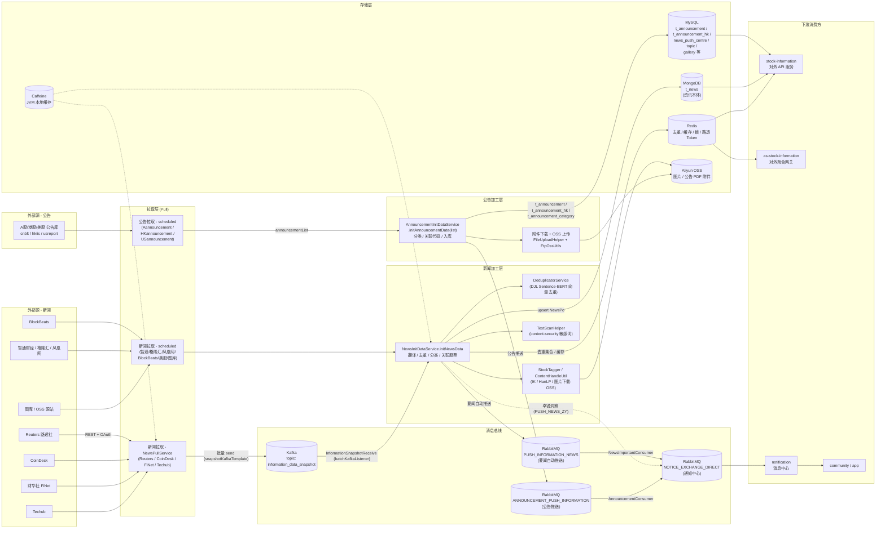
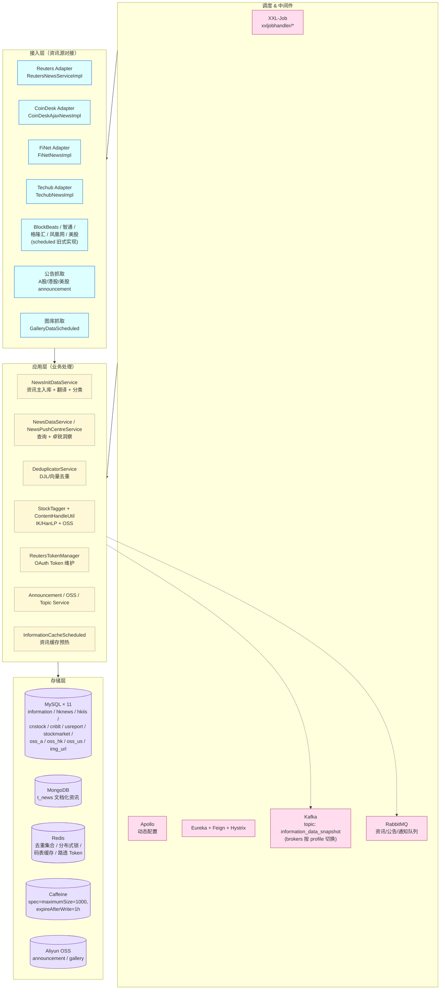

# stock\-information\-data

# stock\-information\-data 项目架构说明

> 参考《柜台行情应用概览》的组织方式，本文从**数据流转 / 系统架构 / 业务范围 / 代码模块 / 实体 ER 图**五个角度梳理 `stock-information-data` 服务，作为后续接手与改造的入口文档。

> 文档路径约定见 `CLAUDE.md`：模块设计与缺陷修复说明放在 `<module>/spec/` 下。

## 如何查看本文档的图

本文中的流程图、架构图、ER 图都是 **Mermaid** 代码块（````mermaid` 开头）。常见 markdown 渲染器需要不同的设置：

- **IntelliJ IDEA / WebStorm**：需要安装并启用官方 **Mermaid** 插件（`Settings → Plugins → Marketplace → Mermaid`），重启后 Markdown 预览面板自带渲染。如果之前装了 Markdown 插件但仍显示原文，去 `Settings → Languages & Frameworks → Markdown` 勾选 *Mermaid*。

- **VSCode**：装扩展 *Markdown Preview Mermaid Support*（vstirbu\.vscode\-mermaid\-preview）即可。

- **GitLab / GitHub**：原生渲染，直接看 Web 端文件预览。

- **Typora / Obsidian / Logseq**：自带渲染。

- **在线临时查看**：把 ````mermaid` 代码块里的内容贴进 [https://mermaid\.live](https://mermaid.live) 即可即时预览。

如果在某个工具里所有图都显示成原始文字，说明该工具未启用 Mermaid 渲染；不是文档本身的问题。

---

## 1\. 项目概述

`stock-information-data` 是 `cms-parent` 仓库下较新的一条**资讯抓取/加工/分发**服务（端口 **1959**，应用名 `stock-information-data`），与既有的 `stock-information`（1214）并行运行，专注于：

- 通过定时任务从外部资讯源拉取**新闻 / 公告 / 图库**等数据，加工成统一的 `NewsVo` / `NewsAiVo` 格式；

- 完成**翻译、分类、去重、关联股票代码、敏感词扫描、图片/附件 OSS 化**等加工流程；

- 把结果分流写入：

    - **资讯本体**（news \+ 类型 / 子类型 / 关联股票 / 关联主题）→ **MongoDB ****`t_news`**（NewsInitDataService 链路已统一切到 Mongo，`NewsMapper` 等 MySQL 写入已注释，详见 §4\.4）；

    - **公告 / 图库 / 推送中心 / 主题 / 路透 metadata** → **MySQL（多数据源）**；

    - **去重集合 / 分布式锁 / 码表 / 路透 Token** → **Redis / Caffeine / OSS**；

- 通过 **Kafka / RabbitMQ** 把要闻、公告、卓锐洞察等推送给消息中心 / APP 用户；

- 对兄弟服务通过 **Feign Facade** 暴露 token、相似度检测等能力。

启动类：StockInformationDataApplication\.java，启用 Eureka / Feign / Hystrix / Apollo / Async 等装配。

---

## 2\. 数据流转

> 图比较密，下方代码块开头加了 `%%{init: useMaxWidth:false, fontSize:18px}%%` —— 渲染器会按图的**自然尺寸**绘制（不再压缩到容器宽度），可能产生横向滚动条但字号清晰。





**节点解释**

平台上的"资讯"是顶层概念，下分两类：**新闻（News）** 与 **公告（Announcement）**。两类各有独立的外部源、拉取层、加工层、存储与推送队列，**不混用** `NewsInitDataService`。

|角色|对应组件|说明|
|---|---|---|
|**Data Source \- 新闻**|外部 HTTP API / RSS：路透 / CoinDesk / FiNet / Techub / 智通 / 格隆汇 / 凤凰网 / BlockBeats / 美股新闻；图库 OSS 源站|多为第三方公开 API 或 RSS，路透还需 OAuth Token；图库走 `GalleryDataScheduled` 拉远程图|
|**Data Source \- 公告**|行情商落地库（`cnblt` / `hkiis` / `usreport`，本服务只读）\+ FTP / HTTP 下载附件 PDF|公告"元数据"在 DB 里，PDF 走 FTP / HTTP 下载后转存 OSS|
|**Pull \- 新闻**|`service/impl/*Impl` 实现 `NewsPullService`；`scheduled/*Scheduled` 旧式定时类|由 XXL\-Job 触发；用 `RedisDistributedLock` 防重复|
|**Pull \- 公告**|`AannouncementDataScheduled` / `HKannouncementDataScheduled` / `USannouncementDataScheduled`|由 `A/HK/US_ANNOUNCEMENT_DATA_SYNCH` XXL\-Job 触发；先 `getMaxAnnex` 取增量起点|
|**Process \- 新闻**|`NewsInitDataService.initNewsData(boolean, NewsVo)` \+ `DeduplicatorService` \+ `StockTagger` \+ `ContentHandleUtil` \+ `TextScanHelper`|落地前完成多语种翻译、向量去重、关联个股、敏感词扫描、图片 OSS 化等。统一入口，**全部新闻源走它**（除独立的美股新闻链路）|
|**Process \- 公告**|`AnnouncementInitDataService.initAnnouncementData(announcementList)` \+ `FileUploadHelper` \+ `FtpOssUtils`|把公告元数据写 MySQL `t_announcement*`，再下载 PDF 附件上传 OSS 并回写 `annex_url`|
|**Bus**|Kafka（路透社批量快照）\+ RabbitMQ 三类队列|Kafka topic `information_data_snapshot` 仅服务路透链路（`snapshotKafkaTemplate` 生产 → 同实例 `InformationSnapshotReceive` 消费回灌）；RabbitMQ 拆三个队列：`PUSH_INFORMATION_NEWS`（要闻自动推送）/ `ANNOUNCEMENT_PUSH_INFORMATION`（公告推送）/ `NOTICE_EXCHANGE_DIRECT`（最终汇到通知中心）|
|**Storage**|MySQL ×11 \+ MongoDB \+ Redis \+ Caffeine \+ OSS|多数据源路由 \+ 文档库 \+ 缓存 \+ 对象存储；**资讯本体**只写 Mongo `t_news`，MySQL 主要承载公告 / 图库 / 推送中心 / 主题 / 路透 metadata 等|
|**Downstream**|`stock-information` / `as-stock-information` / `notification`|通过共享 Redis/Mongo 或 RabbitMQ 消费|

---

## 3\. 系统架构





**主要分层职责**

- **接入层（入口）**：每个资讯源一组实现。

    - **新对接资讯源**走 `NewsPullService` 接口 \+ `NewsPullServiceRegistry` 自动注册（按 `NewsSourceType` 分发）。

    - **历史资讯源**仍以 `scheduled/*Scheduled` 类的方式存在（智通财经、格隆汇、凤凰网、BlockBeats、公告、美股、图库）。

    - **公告**：A 股 `AannouncementDataScheduled` / 港股 `HKannouncementDataScheduled` / 美股 `USannouncementDataScheduled`，从行情商落地库拉取后再上传 OSS。

- **应用层**：业务编排。

    - `NewsInitDataServiceImpl`（标注 `@DataSource(INFORMATION)`）是资讯入库的核心，负责翻译、分类、关联个股、写 **MongoDB ****`t_news`**（同名 MySQL 写入已注释，仅为兼容 `@DataSource` 切面而保留注解）、推送 RabbitMQ。

    - `DeduplicatorService` 通过 DJL（PyTorch \+ onnxruntime \+ HuggingFace Tokenizers）做 Sentence\-BERT 向量化去重。

    - `ReutersTokenManager` 维护路透社 OAuth Token，多实例通过 Redis 共享并由唯一 server 节点刷新。

- **调度 \& 中间件**：

    - **XXL\-Job**：`xxljobhandler/*Handler.java` 注册，所有 cron 名常量集中在 `XxlKeyConstant.StockInformation`。

    - **Apollo \+ Eureka \+ Feign \+ Hystrix**：标准 Spring Cloud 栈。

    - **Kafka**：路透社高吞吐异步通道，topic `information_data_snapshot`，由 `snapshotKafkaTemplate` 生产、`InformationSnapshotReceive` 消费回灌入库。生产 / 消费在同一服务实例内闭环，broker 地址由 Apollo 按 profile 下发（prod / dev / test 各自一组）。`KafkaProducerConfig` 还预留了通用 `default-producer`，目前未被业务代码使用。

    - **RabbitMQ**：要闻自动推送、卓锐洞察、公告通知。

- **存储层**：

    - **MySQL**：通过 `MultipleDataSource + DataSourceAspect` 实现 11 个数据源的 ThreadLocal 路由（参见 MybatisPlusConfig\.java），方法/类上的 `@DataSource(DataSourceEnum.XXX)` 注解决定走哪一个库。**目前实际写入 MySQL 的业务**：公告 \(`t_announcement*`\)、图库 \(`gallery`\)、推送中心 \(`news_push_centre` \+ `news_push_report`\)、主题 \(`topic*`\)、路透 metadata \(`t_reuters_metadata`\)、美股新闻独立链路 \(`US_NEWS*`\)；资讯主表 `news` 及其关联表 \(`news_type` / `news_sub_type` / `news_code` / `news_topic` / `news_operate_log`\) 已停止写入，改由 Mongo `t_news` 文档承载。

    - **MongoDB**：用 `t_news` 集合存放面向消费侧的资讯（含中、繁、英三种语言、关联股票、Topic 等）。**当前 ****`NewsInitDataService.initNewsData`**** 是资讯本体的唯一落地终点**，关联类型 / 子类型 / 股票 / Topic 等都内嵌为 `NewsPo` 文档字段。

    - **Redis**：去重集合（按天）、`stock:all:code:*` 码表缓存、路透社 Token、分布式锁。

    - **Caffeine**：JVM 内本地缓存（`StockCodeCache` / `ReutersMetadataCache` 用 `AtomicReference<Set/Map>` 自实现）。

    - **OSS**：图库与公告 PDF 附件。

### 3\.1 Kafka 配置说明

`stock-information-data` 内部 Kafka 是**生产 \+ 消费同集群闭环**：`ReutersNewsServiceImpl` 用 `snapshotKafkaTemplate` 发到 topic `information_data_snapshot`，同一服务实例的 `InformationSnapshotReceive` 用 `@KafkaListener` 订阅做最终入库与去重。这样把"高吞吐拉取"与"复杂入库逻辑"在时序上解耦，但拓扑上不跨集群。

配置项一览（全部由 Apollo 按 profile 下发，prod / dev / test 各自一组 brokers）：

|用途|Spring 配置 Key|对应 Bean|
|---|---|---|
|Producer（路透）|`spring.kafka.producer.snapshot-producer.bootstrap-servers`|`snapshotKafkaTemplate`（KafkaProducerConfig\.java）|
|Producer（默认 / 通用，目前业务代码未使用）|`spring.kafka.producer.default-producer.bootstrap-servers`|默认 `kafkaTemplate`|
|Consumer|`spring.kafka.consumer.bootstrap-servers` \+ `spring.kafka.consumer.default-consumer.group-id`|`defaultConsumerFactory` / `batchKafkaListenerContainerFactory`（KafkaConsumerConfig\.java）|

**注意点**

- 不同 profile 的 group\-id 不同（生产用 `information_data_snapshot`，dev / test 用 `information_data_snapshot_test`），offset 不互通；切换 profile 后新实例会按 `auto-offset-reset` 从约定位置开始消费。

- producer 和 consumer 都是同一个 Kafka 集群，**不要**把不同 profile 的 brokers 拼到一起；profile 切换时整组配置一起切。

---

## 4\. 业务范围

|能力|入口|说明|
|---|---|---|
|**新闻资讯抓取入库**|XXL\-Job：`ZT_NEWS_DATA_PULL`、`GLH_NEWS_DATA_PULL`、`IFENG_NEWS_DATA_PULL`、`BLOCK_BEATS_*`、`COIN_DESK_PULL`、`FI_NET_PULL`、`REUTERS_PULL`、`TECHUB_*`、`US_NEWS_*` 等（NewsPullDataHandler\.java）|各资讯源的拉取，统一落地到 MongoDB `t_news`（美股新闻 `US_NEWS_*` 是独立链路，写 MySQL `usreport` 库的 `US_NEWS` / `US_NEWS_DETAIL` 两张表）|
|**公告抓取与附件 OSS 上传**|XXL\-Job：`A_ANNOUNCEMENT_DATA_SYNCH` / `HK_ANNOUNCEMENT_DATA_SYNCH` / `US_ANNOUNCEMENT_DATA_SYNCH`（AnnouncementInitDataHandler\.java）|拉公告 \+ 上传附件到 OSS|
|**资讯/异动缓存预热**|`NEWS_CACHE_UPDATE` / `ABNORMAL_NEWS_CACHE_UPDATE`（InformationCacheHandler\.java）|港 A 美股资讯缓存到 Redis，供 `as-stock-information` 直接消费|
|**资讯翻译重试 / 任务结果获取**|`NEWS_TRANSLATION_RETRY` / `NEWS_TRANSLATION_GET_RESULT`（NewsTranslationHandler\.java）|阿里翻译异步任务的轮询|
|**卓锐洞察定时推送**|`PUSH_NEWS_ZY`（PushNewsHandler\.java）|扫 `news_push_centre` 表，按 `pushTarget / groupId` 推送给目标用户|
|**要闻自动推送**|`NewsImportantConsumer`（RabbitMQ Listener）|命中 7\-9/12\-13/16\-21 时段窗口，每个时段限频，使用游标分页推送给所有用户|
|**公告推送**|`AnnouncementConsumer`（RabbitMQ Listener）|把业绩 / 交易 / 股权类公告通过 `MessageCenterFacade` 推给关注该股的用户，过滤资讯免打扰|
|**路透 Token 管理**|REST：`/api/reuters/token/*`；Feign：`ReutersFacade.getCurrentToken`|server 模式刷新并写 Redis；其他实例通过 Redis 读|
|**新闻去重接口**|REST：`/api/informationdata/deduplicator/v1/process`；Feign：`DeduplicatorFacade.process`|调用方传 title/content，返回向量去重结果|
|**股票分词器更新**|`STOCK_SEGMENTATION_UPDATE`（ReloadDeduplicatorHandler\.java）|`StockTagger.registerStockNames()` 把全市场股票名注册到 IK 分词器|
|**Mongo 历史数据补全**|`supplementContentMeta`（NewsTempHandler\.java）|给路透历史新闻补 `social_tags / deduping / content_text` 字段|

**对外 Feign 契约**：stock\-information\-data\-facade

- `DeduplicatorFacade`：`POST /api/informationdata/deduplicator/v1/process`

- `ReutersFacade`：`POST /api/reuters/token/v1/current`

### 4\.1 资讯源详细列表

下表逐个列出每个资讯源的接入形态、数据流转过程与落地表。"实现类"列出对应的 Java 类。"入库 service"是这条数据从 raw 转成统一 `News` 实体后的下游入口，多数走 `NewsInitDataServiceImpl.initNewsData(...)` 这一总入口，再由它扇出到各 mapper。

|\#|源|类型|实现类|XXL\-Job|
|---|---|---|---|---|
|1|**路透社 Reuters**|REST \+ OAuth|ReutersNewsServiceImpl\.java|`REUTERS_PULL`|
|2|**CoinDesk**|HTTP \+ Token|CoinDeskAjaxNewsImpl\.java|`COIN_DESK_PULL`|
|3|**财华社 FiNet**|RSS / XML|FiNetNewsImpl\.java|`FI_NET_PULL`|
|4|**Techub**|RSS / 多语种|TechubNewsImpl\.java|`TECHUB_FAST_PULL` / `TECHUB_INFORMATION_PULL`|
|5|**智通财经**|HTTP API|ZhiTongDataScheduled\.java|`ZT_NEWS_DATA_PULL`|
|6|**格隆汇**|RSS（live / original / news）|GeLongHuiDataScheduled\.java|`GLH_NEWS_DATA_PULL`|
|7|**凤凰网**|HTTP API（多接口）|IfengNewsDataScheduled\.java|`IFENG_NEWS_DATA_PULL`|
|8|**BlockBeats**|REST API|BlockBeatsDataScheduled\.java|`BLOCK_BEATS_FLASH_PULL` / `BLOCK_BEATS_INFORMATION_PULL`|
|9|**美股新闻 / 详情**|HTTP \+ MD5 Token|USStockPullDataScheduled\.java|`US_NEWS_PULL` / `US_NEWS_DETAIL_PULL`|
|10|**图库**|DB → OSS 转换|GalleryDataScheduled\.java|（`@Async` 周期触发）|

#### 1\) 路透社 Reuters

- **数据来源**：Reuters Connect API，`config.getUrls().get(REUTERS)` \+ `/headlines` \+ `/stories/{storyId}`，OAuth Token 由 `ReutersTokenManager` 维护并写 Redis。

- **拉取范围**：全市场 \+ 港股 / 美股 / 期货 / 虚拟资产 / 指数 / 评级 / IPO；通过 tag 集合 \(`A:1 / G:3H / G:6J / M:2IE` 等\) 区分。

- **关键步骤**：流式分页（cursor）\+ 限流（令牌桶 `Semaphore`，`REQUESTS_PER_SECOND` 默认 5）\+ 详情批量并发抓取（`ThreadPoolExecutor`）\+ 语言/标签过滤 \+ 关联个股代码 \+ 分类设置；处理完批量 send Kafka topic `information_data_snapshot`，由本服务 Kafka Consumer \(`InformationSnapshotReceive`\) 订阅同一 topic 反向接收并入库；最后拉取时间写 Redis `news:reuters:information:pullLastTime` 支持断点续传。

- **入库 service**：`NewsInitDataServiceImpl.initNewsData(false, NewsVo)` 异步线程池 `reutersNewsInitExecutor`。

- **落地存储**：MongoDB `t_news`（types / sub\_types / codes / topics 等内嵌为文档字段）；Redis 去重集合 `news:reuters:information:{yyyyMMdd}`；行业 code→name 字典 MySQL `t_reuters_metadata`（`information` 库，启动预热）。

- **PO**：`NewsPo`（Mongo） / `ReutersMetadata`（行业 code→name 字典，MySQL）。历史 PO `News` / `NewsCode` / `NewsType` / `NewsSubType` / `NewsTopic` / `NewsOperateLog` 仍保留但**不再由本链路写入**。

- **下游**：命中要闻 → RabbitMQ `PUSH_INFORMATION_NEWS` → `NewsImportantConsumer`。

#### 2\) CoinDesk

- **数据来源**：CoinDesk REST，`config.getUrls().get(COIN_DESK)` \+ `coinDeskToken`；可选 `coinDeskSendUrl` 转发。

- **拉取范围**：虚拟资产/加密资讯。

- **关键步骤**：分布式锁 → 拉列表 → Redis Set 去重（按天）→ 异步并发取详情 → `SmartContentExtractor` 抽正文 → 关联 VA 代码（`StockCodeCache.getVACodes()`）。

- **入库 service**：`NewsInitDataServiceImpl.initNewsData(...)`。

- **落地存储**：MongoDB `t_news`；Redis 去重集合 `NEWS_COIN_DESK_INFORMATION`。

- **PO**：`NewsPo`。

- **下游**：要闻命中 → RabbitMQ。

#### 3\) 财华社 FiNet

- **数据来源**：财华社 RSS/XML（`config.getUrls().get(FI_NET)`）。

- **拉取范围**：港股 \+ 美股要闻、快讯、新股 IPO。

- **关键步骤**：XML 解析 → 标题/分类映射快讯 vs 要闻 vs IPO → 个股代码关联 → 翻译 → 内容清洗。

- **入库 service**：`NewsInitDataServiceImpl.initNewsData(...)`。

- **落地存储**：MongoDB `t_news`；Redis `NEWS_FI_NET_FAST` 等去重 key；图片走 OSS。

- **PO**：`NewsPo`。

#### 4\) Techub

- **数据来源**：Techub RSS（zh\-CN / zh\-TW / en 多语种 endpoint），`pullNews(true, fast/information)` 区分快讯与要闻。

- **拉取范围**：虚拟资产新闻。

- **关键步骤**：XML 解析 \+ 语言识别（`LanguageDetector`） \+ 关联个股 \+ 分类。

- **入库 service**：`NewsInitDataServiceImpl.initNewsData(...)`。

- **落地存储**：MongoDB `t_news`；Redis `NEWS_TECHUB_FAST` / `NEWS_TECHUB_INFORMATION`。

- **PO**：`NewsPo`。

#### 5\) 智通财经

- **数据来源**：智通财经 HTTP API（`news.zhitong.url`，参数 category=`ganggu` / `meigu`）。

- **拉取范围**：港股、美股按市场分类资讯。

- **关键步骤**：分页倒序遍历；按 `update_time` 检查更新；正文清洗（去掉"智通财经 APP 获悉"等模板词）；翻译。

- **入库 service**：`NewsInitDataServiceImpl.initNewsData(...)` 或 `editNewsData`（按 `original_url + provider` 命中已有 Mongo 文档时走更新）。

- **落地存储**：MongoDB `t_news`（多语言字段、types、codes 内嵌于文档）。

- **PO**：`NewsPo`。

#### 6\) 格隆汇

- **数据来源**：三个 RSS 端点 `news.gelonghui{live,original,news}.url`。

- **拉取范围**：港股 / 美股 / A 股的"业绩直击 / 大行评级 / 新股速递 / 公司信息 / 异动" 等子类。

- **关键步骤**：XML 解析 → 三类（live=快讯 / original=原创 / news=新闻）分别处理 → 子分类映射 → 个股代码关联。

- **入库 service**：`NewsInitDataServiceImpl.initNewsData(...)`。

- **落地存储**：MongoDB `t_news`；Redis 三个去重 key \(`information:gelonghui:live` / `:original` / `:news`\)。

- **PO**：`NewsPo`。

#### 7\) 凤凰网

- **数据来源**：凤凰网多接口（港股新闻 / 港股异动 / 24 小时快讯 / 美股新闻 4 个独立 URL）。

- **拉取范围**：港股、美股要闻 \+ 异动 \+ 快讯。

- **关键步骤**：分布式锁 `LOCK_NEWS_IFENG_BASE_INFO` → 4 个接口顺序调用 → 解析 → `HkStockRelatedInformationCacheService` 取关联个股 → 翻译。

- **入库 service**：`NewsInitDataServiceImpl.initNewsData(...)`。

- **落地存储**：MongoDB `t_news`。

- **PO**：`NewsPo`。

#### 8\) BlockBeats

- **数据来源**：`https://api.theblockbeats.news/v1/`（`open-flash` / `open-information` 两端点）。

- **拉取范围**：虚拟资产快讯 \+ 资讯，多语言（cn / en / cht）。

- **关键步骤**：分页 `PAGE_SIZE=100`、按状态码 `0=success` 校验、多语言版本一并入库、按 thirdId Redis 去重。

- **入库 service**：`NewsInitDataServiceImpl.initNewsData(...)`。

- **落地存储**：MongoDB `t_news`；Redis 去重；图片 OSS。

- **PO**：`NewsPo`。

#### 9\) 美股新闻 / 详情

- **数据来源**：自建中转 `http://zr.szfuit.com:82/usnews/api/list.php` \+ `detail.php`，MD5 Token 鉴权（`ConMD5Utils`）。

- **拉取范围**：美股新闻列表 \+ 新闻详情两个独立任务。

- **关键步骤**：双 XXL\-Job 串联，列表用 `US_NEWS_PULL` 拉条目，详情用 `US_NEWS_DETAIL_PULL` 拉正文；分布式锁 \+ 缓存去重。

- **入库 service**：`USStockNewsRelatedInformationCacheService` / `USStockNewsDetailRelatedInformationCacheService`，类上均 `@DataSource(DataSourceEnum.US_REPORT)`。

- **落地存储**：MySQL **`usreport`**** 库**（与美股公告同库）的 `US_NEWS` \+ `US_NEWS_DETAIL`；Redis 去重集合 `us:newsdata:newIds:{yyyyMMdd}`；分布式锁 `lock:usstockdata:news:pull:*`。**注意**：`mapper/usnews/` 包名是历史误导命名，真实数据源 `@DataSource(US_REPORT)`，`DataSourceEnum` 中**没有** `USNEWS` 枚举值。

- **PO**：`USStockNews` / `USStockNewsDetail`。

- **特点**：这条链路**没有走** `NewsInitDataService` 统一入口，是早于通用化设计的独立流程，与新版 `NewsPullService` 体系并行存在；MySQL 写入未被注释，仍然活跃跑着 `saveBatch` / `insert`。

#### 10\) 图库

- **数据来源**：本地表 `gallery` 中已有的第三方图片 URL。

- **关键步骤**：扫 `conversionFlag=1`（未转换）的记录 → 下载原图 → 上传 Aliyun OSS（bucket = `aliyun.oss.announcement-bucketname`）→ 写回 OSS URL \+ 尺寸 \+ 标记 `conversionFlag=2`。

- **入库 service**：`GalleryDataService`。

- **落地存储**：MySQL `gallery`；Aliyun OSS。

- **PO**：`Gallery` / `ImageUrl` / `ImageUrlWrapper`。

### 4\.2 公告源详细列表

公告源都通过 AnnouncementInitDataHandler\.java 触发，分两步：先调 `pullXxAnnouncement(limit)` 拉公告元数据 → 再调 `uploadXxAnnex(limit)` 把附件转存到 OSS。下游统一通过 AnnouncementConsumer\.java 推送给关注该股票的用户。

|源|实现类|XXL\-Job|数据来源|
|---|---|---|---|
|**A 股公告**|AannouncementDataScheduled\.java|`A_ANNOUNCEMENT_DATA_SYNCH`|`cnblt` 库（行情商落地的 `BLT_BULLETIN*` 系列表）\+ HTTP 下载附件（`aannouncement.pdf.url`）|
|**港股公告**|HKannouncementDataScheduled\.java|`HK_ANNOUNCEMENT_DATA_SYNCH`|`hkiis` 库（HKEx IIS 行情商表）\+ FTP 下载原始 PDF|
|**美股公告**|USannouncementDataScheduled\.java|`US_ANNOUNCEMENT_DATA_SYNCH`|`usreport` 库（SEC Filing 落地表）\+ FTP 下载|

#### A 股公告流转

1. `AnnouncementInitDataService.getMaxAnnex(A.market)` 取自建库已落地的最大附件 ID。

2. 用 `AbltBulletinService.list(...)`（`@DataSource(CN_BLT)`）从 cnblt 库拉新增的 `BLT_BULLETIN` \+ `BLT_BULLETINSECU`（公告主表 \+ 公告与证券关联），按 `id > maxAnnex` 增量；分类用 `AannouncementCategoryEnum`（业绩/交易/股权/上市/其他）。

3. 转换为 `Announcement` \+ `AnnouncementCategory`（多分类一对多），`@DataSource(INFORMATION)` 写入主库。

4. `uploadAAnnex` 阶段：从 `aannouncement.pdf.url` 拼接附件下载，`FileUploadHelper` 上传至 OSS（`announcement/a/...`），更新 `annex_url`。

5. 业绩/交易/股权类调 `AnnouncementPushProducer.sendAnnouncement(...)` → RabbitMQ `ANNOUNCEMENT_PUSH_INFORMATION` → `AnnouncementConsumer` → `MessageCenterFacade.send(...)` → 通知中心。

**涉及 PO**：`BltBulletin` / `BltBulletinsecu` / `BltBulletinannex`（cnblt 只读源）→ `Announcement` / `AnnouncementCategory`（自建主库写入），加 `AnnouncementImportant`（重要标记，可选）。

**涉及表**：`BLT_BULLETIN` / `BLT_BULLETINSECU` / `BLT_BULLETINANNEX`（cnblt，**只读**）；`t_announcement` / `t_announcement_category` / `t_announcement_important`（information，**写入**）。

#### 港股公告流转

1. `getMaxAnnex(HK.market)` 取已落地最大 ID。

2. 从 `hkiis` 库（`HK_IIS_INFORMATION` \+ `HK_IIS_NEWS_ATTACHMENT`）增量拉港交所原始公告。

3. 港股表结构特殊：单条公告可能既有英文版也有中文版，对应 `t_announcement_hk`（英文备份） \+ `t_announcement`（中文主表）；附件清单写 `HkIisNewsAttachment`。

4. `uploadHKAnnex`：从 FTP（hostname / username / password / port 由 `commons-net` 配置）下载 PDF → OSS（`announcement/hk/...`）。

5. 推送链路同 A 股。

**涉及 PO**：`HK_IIS_INFORMATION`（来源端） / `HkIisNewsAttachment`（来源附件） → `Announcement` \+ `AnnouncementHK` \+ `AnnouncementCategory`（写入）。

**涉及表**：`HK_IIS_INFORMATION` / `HK_IIS_NEWS_ATTACHMENT`（hkiis，**只读**）；`t_announcement` / `t_announcement_hk` / `t_announcement_category`（information，**写入**）；OSS bucket `announcement/hk/...`。

#### 美股公告流转

1. `getMaxAnnex(US.market)` 增量。

2. 从 `usreport` 库（`US_IIS_INFORMATION` \+ `US_FILING_SECTION`）拉 SEC Filing 元数据，按 `USFilingSection` 拆分成多个章节落地。

3. `uploadUSAnnex`：FTP 下载 → OSS（`announcement/us/...`）。

4. 不再走"重要公告"推送（美股一般不推 push）。

**涉及 PO**：`USFilingSection`（来源 \+ 写入两端共用） → `Announcement` \+ `AnnouncementCategory`。

**涉及表**：`US_IIS_INFORMATION` / `US_FILING_SECTION`（usreport，**只读** \+ **写入**）；`t_announcement` / `t_announcement_category`（information，**写入**）。

### 4\.3 关键 PO / 表速查

把所有 PO 和它们的归属库 / 用途集中在一张表，方便看 ER 图时回查（同名 PO 可能在不同库重复落地）。

|PO 类|`@TableName`|数据源|用途|
|---|---|---|---|
|`News`|`news`|`INFORMATION`|**历史**资讯主表（多语种 title/content/description \+ 状态 \+ 翻译任务 ID）；当前 `initNewsData` 不再写入，仅供历史数据兼容查询|
|`NewsCode`|`news_code`|`INFORMATION`|**历史** 资讯\-股票多对多；当前内嵌为 `NewsPo.codes` / `news_codes`|
|`NewsType`|`news_type`|`INFORMATION`|**历史** 资讯大类；当前内嵌为 `NewsPo.types`|
|`NewsSubType`|`news_sub_type`|`INFORMATION`|**历史** 子类；当前内嵌为 `NewsPo.sub_types`|
|`NewsTag`|`news_tag`|`INFORMATION`|**历史** 产品标签（1 股票/2 指数/3 基金）|
|`NewsTopic`|`news_topic`|`INFORMATION`|**历史** 资讯\-主题多对多；当前内嵌为 `NewsPo.topic_ids` / `topics`|
|`NewsOperateLog`|`news_operate_log`|`INFORMATION`|**历史** 资讯审核 / 上下架等操作日志|
|`NewsPushCentre`|`news_push_centre`|`INFORMATION`|卓锐洞察推送中间表|
|`NewsPushReport`|`news_push_report`|`INFORMATION`|推送统计报告|
|`NewsSequencePo`|`t_news_seq` \(Mongo\)|MongoDB|资讯文档序列号生成器（保证 newsId 全局递增）|
|`Topic`|`topic`|`INFORMATION`|主题（含运营图、状态、热门标记）|
|`TopicCategory`|`topic_category`|`INFORMATION`|主题分类|
|`Gallery`|`gallery`|`INFORMATION`|图库（OSS 转换状态）|
|`NewsPo`|`t_news`|MongoDB|面向消费侧的资讯文档（聚合 News \+ Type \+ Code \+ Topic）|
|`ReutersMetadata`|`t_reuters_metadata`|`INFORMATION`|路透行业 code → name 字典|
|`Announcement`|`t_announcement`|`INFORMATION`|公告主表（A/港/美 通用）|
|`AnnouncementHK`|`t_announcement_hk`|`INFORMATION`|港股公告英文备份|
|`AnnouncementCategory`|`t_announcement_category`|`INFORMATION`|公告分类多对多（业绩 / 交易 / 股权 / 上市 / 其他）|
|`AnnouncementImportant`|`t_announcement_important`|`INFORMATION`|重要公告摘要|
|`BltBulletin`|`BLT_BULLETIN`|`CN_BLT`|行情商落地的 A 股公告主表（**只读**源）|
|`BltBulletinsecu`|`BLT_BULLETINSECU`|`CN_BLT`|A 股公告与证券的关联（**只读**）|
|`BltBulletinannex`|`BLT_BULLETINANNEX`|`CN_BLT`|A 股公告附件清单（**只读**）|
|`HkIisNewsAttachment`|`HK_IIS_NEWS_ATTACHMENT`|`HK_IIS`|港股 IIS 公告附件清单|
|`USFilingSection`|`US_FILING_SECTION`|`US_REPORT`|美股 SEC Filing 章节切分|
|`USStockNews`|`US_NEWS`|`US_REPORT`（与美股公告同库）|美股新闻列表（独立链路，不走 News 主表）；mapper 包名 `usnews` 是历史误导|
|`USStockNewsDetail`|`US_NEWS_DETAIL`|`US_REPORT`（与美股公告同库）|美股新闻详情|
|`OSSA`|`STK_BASICINFO`|`OSS_A`|A 股基本信息（OSS 同步用）|
|`OSSHK`|`STK_BASICINFO`|`OSS_HK`|港股基本信息|
|`OSSUS`|`STK_BASICINFO`|`OSS_US`|美股基本信息|
|`ImageUrl` / `ImageUrlWrapper`|`t_image_code`|`IMG_URL`|个股代码 → 图片 URL 映射|
|`InformationUrl`|`t_information_url`|`INFORMATION`|资讯 ID → H5 / 短链 URL 映射|

> **注**：`cnblt` / `hkiis` / `usreport` / `cnstock` 这几个库本服务**只读**，是各市场行情商把公告 / 资讯落地后供本服务消费的"上游库"。本服务把它们清洗后写到自建的 `INFORMATION` 主库（`t_announcement*` / `news*`），由 `as-stock-information` 等服务对外提供 API。

### 4\.4 资讯入库链路（`NewsInitDataService.initNewsData`）

`NewsInitDataServiceImpl.initNewsData(boolean needTranslate, NewsVo)` 是**所有走通用接入框架的资讯源的统一入库口**（除美股新闻 `US_NEWS_*` 是独立链路）。它内部按顺序执行：

1. **空文本短路**：`title/content` 三语全空直接返回 `false`。

2. **重复入库前置**：先用 `mongoTemplate.find` 在 `t_news` 上按 `source_id + third_id + pub_time > now-2d` 查命中即跳过（不调 MySQL，也不通过 Redis Set）。

3. **应用 ready 检查**：`AppInitState.isReady()` 未就绪时记 `systemError=true` 并返回，由调用方保留原始数据等待重试。

4. **向量去重**：`DeduplicatorService.processNews(processId, title, content)` 基于 DJL Sentence\-BERT 计算相似度（阈值 0\.9），命中视为重复。

5. **HTML 处理管线**：`HtmlHandlerPipeline`（含 `ExternalLinkHandler` 等）对正文做白名单过滤、外链兜底。

6. **图片 OSS 化**：`ContentHandleUtil.replaceContentImgToOSS(...)` 替换 HTML 中的远程图片为本地 OSS URL；标题图 `themeImg` 同样上传或按关键词从 `GalleryKeyWordCache` 兜底。

7. **三语补齐 / 翻译**：缺中文从繁体调 `conversionContentLanguage` 转，缺繁体同理；阿里翻译用于补齐英文 → 文档翻译异步任务 ID 写回 `NewsPo.contentEnTaskId / contentCnTaskId`，由 `NEWS_TRANSLATION_GET_RESULT` 后台轮询取结果（通过 `translate(newsId)` / `setTranslateResult(...)`）。

8. **敏感词扫描**：`TextScanHelper`（`content-security-component`）分别扫 简 / 繁 / 英 文本，任一不通过则 `status=2`（审核失败）\+ 记 `reviewFailReason`。

9. **MongoDB 写入**：`newsDao.save(newsPo)` → 集合 `t_news`，单文档承载所有字段（含 `types / sub_types / codes / topic_ids / topics / langs / content_meta` 等内嵌数据）。

10. **关联补充**：`saveRelated(types, subTypes, codeTags, newsId, topics)` 把分类、子类、关联股票（code 前缀拼 `ts_`）、Topic 等回写到同一 `NewsPo` 文档（仍是 Mongo `newsDao.save`），不再写 MySQL `news_type` / `news_sub_type` / `news_code` / `news_topic` 等关联表。

11. **后续动作**：`status == NOT_TRANSLATE` 时调 `translate(newsId)` 触发翻译；`status == LISTING` 时调 `pushImportNews(newsId)` 把 NewsVo 推到 RabbitMQ `PUSH_INFORMATION_NEWS`，由 `NewsImportantConsumer` 按时段窗口（7\-9 / 12\-13 / 16\-21）转推。

> **注意**：源码 `NewsInitDataServiceImpl.java:378` 把 `newsMapper.insert(newAdd)` 注释掉了；类上仍 `@Autowired` 的 `NewsMapper` / `NewsTypeMapper` / `NewsSubTypeMapper` / `NewsCodeMapper` / `NewsTopicMapper` 在当前代码路径下**没有调用点**，等同于历史残留。所属的 MySQL 表（`news` / `news_type` / `news_sub_type` / `news_code` / `news_topic` / `news_operate_log`）仍保留历史数据但不再增量写入；`as-stock-information` / `stock-information` 等消费侧统一从 Mongo `t_news` 读。

### 4\.5 卓锐洞察推送链路（运营手工资讯推送）

「卓锐洞察」是 **平台运营人员手工筛选 / 编辑 / 审核的精品资讯推送**——与上一节算法自动判定的「要闻」不同，这条链路从头到尾都是人工流程。XXL\-Job 名 `PUSH_NEWS_ZY`（**ZY = ZhuoRui 卓锐**）。

#### 4\.5\.1 数据模型：`news_push_centre` \+ `news_push_report`

`NewsPushCentre`（NewsPushCentre\.java）是卓锐洞察的主表，PK = `news_id`（**1\-1 关联** `news.id`）。一条卓锐洞察 = `news` 表里一条资讯 \+ `news_push_centre` 里一条推送配置。

|字段|含义|
|---|---|
|`news_id` PK|关联到 `news.id`（已上架的资讯）|
|`news_title` / `news_content`|推送文案（**可由运营改写**，不一定等于原资讯标题/正文）|
|`push_target`|1=全部用户 / 2=大陆 / 3=非大陆 / 4=指定群组|
|`filter_dimension`|1=手机号 / 2=IP / 3=证件（圈选大陆/非陆时的依据）|
|`push_way`|**1=立即推送** / **2=定时推送**|
|`timer_push_time`|定时推送目标时间（`push_way=2` 时用）|
|`is_push`|启用开关：1=启用，0=暂停（运营可随时改）|
|`push_status`|0=未推过 / 1=已推过（推送后由系统置 1）|
|`is_show_push`|0=显示推送按钮 / 1=不显示（定时推送时设 1，避免手工重推）|
|`group_id`|`push_target=4` 时的目标用户组 ID|
|`create_time` / `update_time`|审计字段|

`NewsPushReport`（`news_push_report`）记录每次推送的统计：`news_id` / `news_title` / `total`（目标总人数）/ `push_success_count` / `push_fail_count` / `push_time`，关系 = NewsPushCentre 1\-N NewsPushReport（同一篇洞察可能被推多次，例如运营改了内容重推）。

#### 4\.5\.2 完整流程（5 个阶段）

```mermaid
sequenceDiagram
    autonumber
    participant Op as 运营管理后台
    participant SI as stock-information<br/>ConNewsController
    participant DB as MySQL<br/>news + news_push_centre
    participant Mg as MongoDB t_news
    participant XJ as XXL-Job<br/>PUSH_NEWS_ZY
    participant SID as stock-information-data<br/>PushNewsHandler
    participant Svc as NewsDataService
    participant UF as user-account /<br/>user-group /<br/>open-account /<br/>login-device Feign
    participant MC as MessageCenterFacade
    participant Q as RabbitMQ<br/>NOTICE_EXCHANGE_DIRECT
    participant Nt as notification
    participant App as APP

    Op->>SI: POST /api/con/news/...<br/>NewsAddVo (含 news 内容 + 推送配置)
    SI->>DB: INSERT news (is_recommend=1, recommended_bit=2)
    SI->>DB: INSERT news_push_centre (push_way, push_target, ...)
    SI->>Mg: upsert t_news (让 APP 卓锐洞察 Tab 也能看到)

    alt push_way = 1 立即推送
        SI->>Svc: queryUserIds(target, dimension, groupId)
        Svc->>UF: 多个 Feign（见 4.5.3）
        UF-->>Svc: Set<userId>
        SI->>MC: 推送（见 4.5.4）
    else push_way = 2 定时推送
        Note over XJ,SID: 每分钟扫表
        XJ->>SID: 触发 pushManualTask
        SID->>DB: selectFutureList (timer_push_time <= NOW())
        DB-->>SID: List<NewsPushCentre>
        loop 每条到点记录
            SID->>Svc: queryUserIds(target, dimension, groupId)
            Svc->>UF: 多个 Feign
            UF-->>Svc: Set<userId>
            SID->>MC: 推送
            SID->>DB: UPDATE news_push_centre SET push_status=1, is_show_push=0
        end
    end

    Note over MC,Q: NewsPushProducer.sendNewsPush 内部
    MC->>MC: getDisturbFreeUserIds(code=07, userIds)<br/>过滤资讯免打扰用户
    MC->>DB: INSERT news_push_report (total, news_id, push_time)
    MC->>Q: convertAndSend(NoticeMessageVo)<br/>code=OPERATOR_NEWS<br/>businessId=newsPushReport.id<br/>topBanner=true, externalNotice=true
    Q-->>Nt: 消费
    Nt->>App: APNs / FCM / 内信推送
    App->>App: 用户点击 → H5 详情页```

#### 4\.5\.3 目标用户筛选：`NewsDataService.queryUserIds(pushTarget, filterDimension, groupId)`

按 `push_target` 走不同分支（NewsDataServiceImpl\.java:529\-565）：

|`push_target`|调用的 Feign|入参|返回|
|---|---|---|---|
|1 = 全部用户 \(`ALL`\)|`userAccountFacade.getUserIds()`|\-|全平台所有用户 ID|
|2 = 大陆 / 3 = 非大陆 \(`CN` / `NOT_CN`\)|按 `filter_dimension` 再分：<br>• 1 PHONE：`userAccountFacade.getUserIdsByPhone(target)`<br>• 2 ADD\_IP：`loginDeviceFacade.queryByIp(target)`<br>• 3 CARD：`openFacade.queryByIdentityType(target)`|`pushTarget` 传入区分大陆/非陆|命中维度的用户子集|
|4 = 指定群组 \(`GROUP`\)|`userGroupFacade.getUserIds(groupId)`|`groupId`|该用户组成员|
|`ACTIVATE`（已激活用户，特殊场景）|`openFacade.queryActivateUser()`|\-|全部已开户用户|

各 Feign 失败时抛 `ApiException`，整批推送会回滚。

#### 4\.5\.4 实际推送：`NewsPushProducer.sendNewsPush(centre, target, userIds)`

NewsPushProducer\.java 的 `sendNewsPush` 内部 5 步：

1. **资讯免打扰过滤**：调 `messageCenterFacade.getDisturbFreeUserIds(disturbFreeVo)`，`code=07`（资讯类免打扰码），传入候选 `userIds` \+ 当前时间（`HH:mm`）；返回 **不在免打扰名单内** 的用户子集。若过滤后为空，直接 return 不推。

2. **写推送报告**：插入 `news_push_report`（`id` = `IdUtil.simpleUUID()`，`total` = 过滤后人数）。

3. **正文清洗**：`contentHandleUtil.removeHtmlTag(newsContent)` 把 HTML 标签剥掉，截到 200 字内（推送通知有长度限制）。

4. **构造 ****`NoticeMessageVo`**：

    - `code = NoticeCodeEnum.OPERATOR_NEWS`（"运营推送"通知码，APP 端据此分类显示）

    - `category = NoticeCategoryEnum.MULTI_WITH_USER_ID_LIST`（按 userIds 列表推）

    - `messageId = IdUtil.objectId()` / `businessId = newsPushReport.id`

    - `appendix.url` = H5 详情页（`String.format(baseUrl, newsId, null, null)`）

    - `userIds` = 上步过滤后的用户集合

    - `topBanner = true`（顶部横幅展示）

    - `externalNotice = true`（APNs / FCM 系统通知）

5. **发到 RabbitMQ**：`rabbitTemplate.convertAndSend(MQConstant.Notice.NOTICE_EXCHANGE_DIRECT, NOTICE_MESSAGE_QUEUE, JSON)` → 由 `notification` 服务消费后真正下发到 APP。

#### 4\.5\.5 「卓锐洞察 Tab」与「卓锐洞察推送」的关系

APP 主页有一个 **「卓锐洞察」Tab**（见 APP 截图），它和本节描述的「推送」是**两条独立链路**，但**数据交叉**：

|维度|卓锐洞察 Tab（拉取式）|卓锐洞察推送（推送式，本节）|
|---|---|---|
|触发方|APP 主动|运营手工 / 定时任务|
|入口接口|`POST /api/news/v1/get_recommend`|`news_push_centre` \+ `PUSH_NEWS_ZY`|
|数据源|Mongo `t_news` 中 `is_recommend=1 ∨ recommended_bit=2`|MySQL `news_push_centre`|
|通道|HTTP 同步返回|RabbitMQ → notification → APNs / FCM|
|收件人|任何打开 Tab 的用户|由 `push_target` / `filter_dimension` / `group_id` 决定|

运营在管理后台**标记一条卓锐洞察的同时**会做两件事：

1. 把 `news.is_recommend` 置 1（让 Tab 也能展示）；

2. 插入一条 `news_push_centre` 记录（驱动推送）。

所以一条卓锐洞察会**先在 Tab 上可见**（即时生效），**再通过推送通道下发到推送目标**（按 push\_way 决定时机）。两者解耦，方便运营对"展示"和"推送"做分开的开关控制。

#### 4\.5\.6 涉及的代码与 PO 速查

|类 / 表|位置|作用|
|---|---|---|
|`ConNewsController` / `ConNewsFacade`|stock\-information|运营后台入口（编辑 \+ 标记 \+ 立即/定时配置）|
|`NewsDataServiceImpl.addNews` / `updateNews`|stock\-information \+ stock\-information\-data|处理新增 / 编辑，写 `news_push_centre`|
|`NewsDataServiceImpl.queryUserIds`|同上|按推送目标圈选用户|
|`NewsDataServiceImpl.selectFutureList`|同上|扫定时到点的 `news_push_centre`|
|`NewsPushCentreServiceImpl`|同上|`news_push_centre` CRUD|
|`NewsPushReportServiceImpl`|同上|`news_push_report` 写入|
|PushNewsHandler\.pushManualTask|stock\-information\-data|XXL\-Job `PUSH_NEWS_ZY` 定时入口（每分钟）|
|NewsPushProducer\.sendNewsPush|两侧都有|实际发到 `NOTICE_EXCHANGE_DIRECT`|
|`NewsPushCentre` PO ↔ `news_push_centre` 表|1\-1 关联 `news`|推送配置|
|`NewsPushReport` PO ↔ `news_push_report` 表|1\-N from `news_push_centre`|推送报告|

---

## 5\. 代码模块

### 5\.1 顶层 Maven 结构

```Plaintext
stock-information-data/
├── pom.xml                                  # parent，packaging=pom
├── stock-information-data-facade/           # 对外 Feign 契约 + Hystrix 兜底 + 共享 VO
│   └── com.zhuorui.stockinformationdata
│       ├── facade/                          # @FeignClient 接口
│       ├── fallback/                        # Hystrix FallbackFactory
│       └── vo/                              # 跨服务 VO（ProcessNewsVO / ProcessNewsResponseVO）
└── stock-information-data-server/           # Spring Boot 应用，packaging=jar
```

### 5\.2 server 模块的包视图

```Plaintext
com.zhuorui.stockinformationdata
├── StockInformationDataApplication.java     # 启动类
├── boot/
│   ├── DefaultInitApplication.java          # @Order(MIN_VALUE) ApplicationRunner，
│   │                                          预热 Caffeine 码表、路透元数据、股票分词、
│   │                                          DJL 向量库；最后启动 Kafka 监听
│   └── AppInitState.java                    # 标记应用 ready
├── cache/
│   ├── StockCodeCache.java                  # 港 / 美 / VA 股票代码缓存（@Scheduled 3h）
│   ├── ReutersMetadataCache.java            # 路透 metadata code→name 映射
│   ├── GalleryKeyWordCache.java             # 图库关键词
│   └── ImageCodeCache.java                  # 图片码表
├── config/
│   ├── annotation/DataSource.java           # @DataSource(DataSourceEnum.XXX)
│   ├── datasource/                          # MultipleDataSource + Aspect + ContextHolder
│   ├── db/MybatisPlusConfig.java            # 11 个 DataSourceConfig + sqlSessionFactory
│   ├── kafka/                               # Producer / Consumer / HaConfig
│   ├── reuters/                             # Token 管理 + Auth 拦截器 + 限流配置
│   ├── httpconfig/                          # 全局 RestTemplate / OkHttp 配置
│   ├── machinetranslation/                  # 阿里机翻 handler 配置
│   ├── AsyncConfig.java                     # 各业务线程池（reutersNewsInitExecutor 等）
│   ├── NewsSourceConfig.java                # @ConfigurationProperties("news") URL/Token 等
│   └── WebConfig.java                       # MVC / 拦截器
├── constant/                                # 各类常量
├── controller/
│   ├── DeduplicatorController.java          # 去重接口
│   └── ReutersTokenController.java          # Token 状态/刷新
├── dao/                                     # 自定义 DAO（NewsDao + impl）
├── dto/                                     # FinnHubNewsDto 等服务内部 DTO
├── enums/
│   ├── NewsPullTypeEnum.java                # FAST / INFORMATION
│   └── NewsSourceType.java                  # COIN_DESK / FI_NET / REUTERS / TECHUB
├── handle/ListTypeHandler.java              # MyBatis 自定义类型处理
├── handler/                                 # HTML 内容清洗管线（DefaultHtmlHandlerPipeline 等）
├── interceptor/                             # MVC 拦截器
├── jms/
│   ├── InformationSnapshotReceive.java      # Kafka 路透快照消费（批量保存→入库）
│   ├── AnnouncementConsumer.java            # RabbitMQ 公告推送
│   ├── NewsImportantConsumer.java           # RabbitMQ 要闻自动推送
│   └── producer/                            # NewsPushProducer / AnnouncementPushProducer
├── mapper/                                  # MyBatis-Plus mapper（按 11 库分目录）
│   ├── news/  announcement/  hkiis/  hknews/
│   ├── cnblt/ cnstock/ usnews/ usreport/  oss/
├── po/                                      # 实体（既有 @TableName MySQL，也有 @Document Mongo）
├── registry/
│   ├── NewsPullServiceRegistry.java         # 自动收集所有 NewsPullService Bean，按 NewsSourceType 分发
│   └── NewsProcessorServiceRegistry.java    # 同上，针对 PageProcessor（WebMagic）
├── scheduled/                               # 旧式数据源拉取（智通/格隆汇/凤凰网/BlockBeats/
│   │                                          公告 A/HK/US / 美股新闻 / 图库 / 资讯缓存）
├── service/
│   ├── NewsPullService.java                 # 新拉取接口（getSourceType + pullNews）
│   ├── NewsProcessorService.java            # 新拉取接口（PageProcessor 风格）
│   ├── DeduplicatorService.java             # 向量去重接口
│   ├── impl/                                # ReutersNewsServiceImpl / CoinDeskAjaxNewsImpl /
│   │                                          FiNetNewsImpl / TechubNewsImpl 等 + 向量去重
│   ├── news/                                # 新闻、推送中心、推送报告、Topic、ReutersToken/Metadata
│   ├── announcement/  cnblt/  cnstock/  hkiis/  hknews/
│   ├── oss/                                 # 图片/附件 OSS 同步服务
│   ├── usnews/  usreport/
│   └── reuters/                             # source/sink/model 三层（重构中的新实现）
├── util/                                    # 去重器（DJL/Java 实现） / 内容清洗 / 关联代码 /
│                                              语言检测 / 智能正文抽取 / 同义词 / 股票分词 / Token Redis
├── vo/                                      # 服务内部 VO（NewsExtractReqVO / StoryInfo / ReutersToken 等）
└── xxljobhandler/                           # 全部 XXL-Job 入口（每个 handler = 一组业务任务）
```

### 5\.3 关键设计点

1. **拉取接口的双形态**：

    - 老逻辑：`scheduled/*Scheduled` 直接用 `@Component` \+ `RestTemplate`/`Jsoup`，由 XXL\-Job handler 调用其方法。

    - 新逻辑：抽象出 `NewsPullService`（HTTP）和 `NewsProcessorService`（WebMagic PageProcessor）两个 SPI，所有实现自动注册到 `NewsPullServiceRegistry / NewsProcessorServiceRegistry`，按 `NewsSourceType` 分派。新接资讯源建议走这条路径。

2. **多数据源路由**：`@DataSource(DataSourceEnum.XXX)` 切面在 `*ServiceImpl` 之前 \(`@Order(-1)`\) 切入，方法注解可覆盖类注解。新增数据源需在 `MybatisPlusConfig` 中加 Bean 并放进 `MultipleDataSource.targetDataSources`。

3. **路透社接入的特殊性**：

    - **限流**：自实现令牌桶 `Semaphore + ScheduledExecutorService`（`REQUESTS_PER_SECOND` / `RATE_LIMIT_CAPACITY`）。

    - **大流量异步通道**：本服务侧负责拉取与初步过滤后写 Kafka topic `information_data_snapshot`；同实例 Kafka Consumer \(`InformationSnapshotReceive`\) 反向接收做最终入库与去重，避免阻塞拉取。

    - **断点续传**：每页处理后写 Redis key `news:reuters:information:pullLastTime`。

    - **OAuth Token**：通过 `ReutersTokenManager` 获取；多实例时唯一 server 实例刷新并写 Redis（参考 ReutersTokenController\.java）。

4. **去重器**：基于 DJL（PyTorch Engine \+ ONNX Runtime \+ HuggingFace Tokenizers）的 Sentence\-BERT 向量化方案，启动时通过 `DefaultInitApplication.run()` 一次性预热向量库（失败则启动失败）。

5. **启动顺序**（`DefaultInitApplication`，`@Order(Integer.MIN_VALUE)`）：

    1. 显式启动所有 Kafka Listener（`autoStartup=false` 由本类统一拉起）；

    2. `reutersMetadataCache.refreshCache()`；

    3. `stockCodeCache.refreshCache()`；

    4. `stockTagger.registerStockNames()` 注册全市场名称到 IK；

    5. `deduplicatorService.initDeduplicator()` 加载向量库；

    6. `appInitState.setReady()`。

---

## 6\. 实体 ER 图

> 资讯主库（`information` 数据源）的核心实体关系。其他库（hknews/hkiis/cnstock/cnblt/usreport 等）多为只读副本/外部行情商库，不在 ER 中重复。

> ⚠️ **重要变更**：下图中的 `NEWS` / `NEWS_TYPE` / `NEWS_SUB_TYPE` / `NEWS_TAG` / `NEWS_CODE` / `NEWS_TOPIC` / `NEWS_OPERATE_LOG` 仅作为**历史 schema** 参考保留——当前 `NewsInitDataService.initNewsData` 链路**不再写入**这几张表（详见 §4\.4 与 §4\.3 PO 速查里的"历史"标记）。资讯本体的活跃存储是 MongoDB `t_news`（NewsPo\.java，见 §6\.2）。`NEWS_PUSH_CENTRE` / `NEWS_PUSH_REPORT` / `TOPIC` / `TOPIC_CATEGORY` 仍是活跃 MySQL 表。

```mermaid
erDiagram
    NEWS ||--o{ NEWS_TYPE          : "1-N 类型"
    NEWS ||--o{ NEWS_SUB_TYPE      : "1-N 子类型"
    NEWS ||--o{ NEWS_TAG           : "1-N 产品标签"
    NEWS ||--o{ NEWS_CODE          : "1-N 关联股票"
    NEWS ||--o{ NEWS_TOPIC         : "1-N 主题关联"
    NEWS ||--o{ NEWS_OPERATE_LOG   : "1-N 操作日志"
    NEWS ||--o| NEWS_PUSH_CENTRE   : "1-1 卓锐洞察推送"
    NEWS_PUSH_CENTRE ||--o{ NEWS_PUSH_REPORT : "1-N 推送报告"
    TOPIC ||--o{ NEWS_TOPIC        : "1-N"
    TOPIC_CATEGORY ||--o{ TOPIC    : "1-N"

    NEWS {
        int       id PK
        string    third_id
        int       source_id
        string    title
        string    title_tw
        string    title_en
        string    content
        string    content_tw
        string    content_en
        string    description
        string    description_tw
        string    description_en
        string    source
        string    source_tw
        string    source_en
        string    pub_time
        string    theme_img
        string    original_url
        string    provider
        int       status
        string    codes
        int       important
        int       is_hot
        int       is_recommend
        int       is_audit
        int       recommended_bit
        string    banner_image
        string    review_fail_reason
        string    key_words
        string    content_en_task_id
        string    content_cn_task_id
        int       translate_count
        datetime  create_time
        datetime  update_time
    }
    NEWS_TYPE {
        int id PK
        int news_id FK
        int type
    }
    NEWS_SUB_TYPE {
        int id PK
        int news_id FK
        int type
        int sub_type
    }
    NEWS_TAG {
        int id PK
        int news_id FK
        int tag
    }
    NEWS_CODE {
        int    id PK
        int    news_id FK
        string code
        string ts
        int    tag
    }
    NEWS_TOPIC {
        int id PK
        int news_id FK
        int topic_id FK
    }
    NEWS_OPERATE_LOG {
        int    id PK
        int    news_id FK
        int    status
        string remark
    }
    NEWS_PUSH_CENTRE {
        int    news_id PK
        string news_title
        string news_content
        int    push_status
        int    is_push
        int    push_target
        int    filter_dimension
        int    is_show_push
        int    push_way
        date   timer_push_time
        string group_id
        date   create_time
        date   update_time
    }
    NEWS_PUSH_REPORT {
        string id PK
        int    news_id FK
        string news_title
        int    total
        int    push_success_count
        int    push_fail_count
        date   push_time
    }
    TOPIC {
        int    id PK
        string name
        string description
        int    category_id FK
        string head_img
        string background_img
        int    status
        int    is_hot
        int    sort
        int    type
    }
    TOPIC_CATEGORY {
        int    id PK
        string name
    }```


**字段语义说明**（ER 图为兼容老版 Mermaid，去掉了字段尾注释，含义在此补充）：

> 表中 `news_type.type` / `news_sub_type.sub_type` 的全量取值见 §6\.3 关键枚举类型速查里的 `NewsCategoryEnum` / `NewsSubCategoryEnum`，下面只列其他没有对应枚举类、纯数据库字段约定的取值。

|表 / 字段|取值|
|---|---|
|`news_type.type`|见 §6\.3 `NewsCategoryEnum`（16 个值）|
|`news_sub_type.sub_type`|见 §6\.3 `NewsSubCategoryEnum`（10 个值）|
|`news_tag.tag`|1=股票，2=指数，3=基金|
|`news_push_centre.push_target`|1=全部用户，2=大陆用户，3=非大陆用户，4=指定群组|
|`news_push_centre.filter_dimension`|1=手机号，2=IP，3=证件|
|`news_push_centre.push_way`|1=立即推送，2=定时推送|
|`topic.type`|0=通用，1=风险早知道，2=机会风向标|

### 6\.1 公告相关 ER（A 股 / 港股 / 美股）


```mermaid
erDiagram
    T_ANNOUNCEMENT ||--o{ T_ANNOUNCEMENT_CATEGORY : "1-N 分类"
    T_ANNOUNCEMENT ||--o| T_ANNOUNCEMENT_IMPORTANT : "0-1 重要标记"
    T_ANNOUNCEMENT_HK {
        int    id PK
        string thrid_id
        string name
        date   pub_date
        string annex_url
        string annex_format
        string content
        string code
        string ts
        int    market
        int    category
        string category_code
        int    status
    }
    T_ANNOUNCEMENT {
        int    id PK
        string thrid_id
        string line_id
        string name
        date   pub_date
        string annex_url
        string annex_format
        string content
        string code
        string ts
        int    market
        string category_code
        int    status
    }
    T_ANNOUNCEMENT_CATEGORY {
        int announcement_id FK
        int category
    }
    T_ANNOUNCEMENT_IMPORTANT {
        int    announcement_id PK
        string name
        string summary
        date   important_time
    }```

`t_announcement_category.category` 与 `t_announcement_hk.category` 取值：1=业绩公告，2=交易相关，3=股权股本，4=上市文件，5=其他公告。

### 6\.2 MongoDB 文档（消费视角）

`t_news`（NewsPo\.java）是 MongoDB 中**面向 APP/对外 API**的物化形态，把 MySQL 中分散的 `news + news_type + news_sub_type + news_code + news_topic` 等聚合到一个文档里：

```Plaintext
t_news {
  newsId, third_id, source, source_tw, source_en,
  title, title_tw, title_en,
  content, content_tw, content_en,
  description, description_tw, description_en,
  pub_time, theme_img, banner_image, original_url,
  status, important, is_hot, is_recommend, is_audit, recommended_bit,
  types: [String],          // 资讯大类
  sub_types: [String],      // 子类
  codes: [String],          // 关联股票
  ts, stock_name, stock_names: [{ts, code, name, ...}],
  topic_ids: [String], topics: [TopicDto],
  langs: [String],          // zh-CN / zh-TW / en-US
  news_codes: [NewsCodeDto],
  content_meta: { social_tags, deduping },
  content_text,             // 路透补全字段
  ...
}
```

### 6\.3 关键枚举类型速查

所有枚举类位于 `stock-information-facade` 模块的 `com.zhuorui.stockinformation.enums` 包；`NewsSourceType` / `NewsPullTypeEnum` 例外，位于本服务 `com.zhuorui.stockinformationdata.enums`。下面按 **新闻 / 公告 / 多语言 / 多数据源 / 第三方分类** 五组列出。

#### 资讯顶层：CategoryEnum

API 入参用，对应 `InformationCacheUtil` 资讯总分类。

|value|code|名称|
|---|---|---|
|`ALL`|0|全部|
|`NEWS`|1|新闻|
|`ABNORMAL_NEWS`|2|异动|
|`BULLETIN`|3|公告|

#### 新闻：NewsCategoryEnum

对应 `news_type.type` / `NewsPo.types`（资讯大类）。

|value|code|名称|备注|
|---|---|---|---|
|`MAJOR_NEWS`|0|要闻|自动推送窗口的触发类|
|`HK`|1|港股||
|`US`|2|美股||
|`FAST`|3|快讯<br>|7×24 实时流，子分类用 `NewsSubCategoryEnum`|
|`TOPIC`|4|专题||
|`CHANGE`|5|异动||
|`NEW_STOCK`|6|新股||
|`AI_STOCK`|7|AI 看盘||
|`NEWS`|8|新闻（个股）||
|`BULLETIN`|9|公告|这里只是新闻的"公告"分类标签，不是公告主表|
|`RATING`|10|评级||
|`MACRO`|11|宏观||
|`PUSH`|12|推送||
|`OTHER`|13|其他||
|`ZHUORUI_LOOKS_AT_THE_MARKET`|14|卓锐看市|子分类用 `NewsSubCategoryEnum` 1001\-1004|
|`VA_NEWS`|15|虚拟资产||

#### 新闻：NewsSubCategoryEnum

对应 `news_sub_type.sub_type`。两段编码：1\-6 是**快讯子项**，1001\-1004 是**卓锐看市子项**。

|value|code|名称|父类|
|---|---|---|---|
|`GLOBAL`|1|全球|FAST|
|`INDEX`|2|指数|FAST|
|`HK`|3|港股|FAST|
|`US`|4|美股|FAST|
|`FUTURES`|5|期货|FAST|
|`VA`|6|虚拟资产|FAST|
|`EARLY_COMMENTS`|1001|早评|卓锐看市|
|`LATE_COMMENTS`|1002|晚评|卓锐看市|
|`HOTSPOT`|1003|热点|卓锐看市|
|`WEEKLY_REVIEW`|1004|周评|卓锐看市|

#### 新闻：NewsStatusEnum

对应 `news.status`。

|value|code|名称|
|---|---|---|
|`LISTING`|0|上架（可对外展示）|
|`AUDITING`|1|审核中（命中敏感词等）|
|`AUDIT_FAIL`|2|审核失败|
|`DELIST`|3|下架|
|`NOT_TRANSLATE`|4|未翻译|
|`TRANSLATE_FAIL`|5|翻译失败|

#### 新闻：NewsSourceType（stock\-information\-data 独有）

`NewsPullService.getSourceType` 的标识，用于 `NewsPullServiceRegistry` 自动路由。

|value|code|名称|
|---|---|---|
|`COIN_DESK`|1|coindesk|
|`FI_NET`|2|财华社|
|`REUTERS`|3|路透社|
|`TECHUB`|4|Techub|

#### 新闻：NewsPullTypeEnum（stock\-information\-data 独有）

`NewsPullService.pullNews(boolean, String param)` 中 `param` 入参取值，目前仅 Techub 用。

|value|含义|
|---|---|
|`FAST`|拉快讯|
|`INFORMATION`|拉要闻|

---

#### 公告：AannouncementCategoryEnum

A 股 / 港股公告大类，对应 `t_announcement_category.category` 和 `t_announcement_hk.category`。

|value|code|名称|
|---|---|---|
|`PERFORMANCE`|1|业绩公告|
|`TRANSACTION_RELATED`|2|交易相关|
|`EQUITY`|3|股权股本|
|`LISTING_DOCUMENTS`|4|上市文件|
|`OTHER`|5|其他|

#### 公告：AannouncementCategoryCodeEnum（A 股 → 大类映射）

`cnblt.BLT_BULLETIN.BULLETIONCATEGORY` 的细分 code（60\+ 项），每一项最终归到上面 `AannouncementCategoryEnum` 5 个大类之一。下表按归属大类汇总：

|归属大类|典型 code 段|代表公告类型|
|---|---|---|
|**业绩公告**|1000 / 1010 / 1100 / 1211\-1276|业绩快报 / 业绩说明会 / 业绩预告 / 一季报\~年报 全文/摘要/更正补充 / 中报 / 定期报告其它|
|**交易相关**|1412 / 6521 / 8079|交易异常波动公告 / 关联交易 / 限售股流通公告|
|**股权股本**|1386\-1388 / 1415 / 8081 / 1320\-1339|股东增减持 / 股东股权变动 / 权益变动报告书 / 增发新股招股说明书 / 配股说明书 等|
|**上市文件**|1309\-1319 / 1340\-1355 / 8014|招股说明书 / 上市公告书 / 新股发行公告 / 可转债募集说明书 / 债券募集说明书 等|

详细 60\+ 项映射见 AannouncementCategoryCodeEnum\.java。

#### 公告：HKannouncementCategoryCodeEnum（港股 → 大类映射）

`hkiis.HK_IIS_INFORMATION` 的 HKEx 分类码（100\+ 项）。按大类汇总：

|HKEx 大类（繁体原文）|code 段|归属 `AannouncementCategoryEnum`|
|---|---|---|
|財務報表/環境、社會及管治資料|40000\-40400|PERFORMANCE / OTHER|
|關連交易|11100\-11500 / 21100\-21200|TRANSACTION\_RELATED|
|財務資料|13200\-13650|PERFORMANCE|
|須予公布的交易|16100\-16900 / 24100\-24500|TRANSACTION\_RELATED|
|合併守則 \- 交易披露|55000|TRANSACTION\_RELATED|
|上市文件|30000\-31200 / 73100\-73600|LISTING\_DOCUMENTS|
|證券／股本|18100\-18540 / 26100\-26850|EQUITY|
|月報表|51500|EQUITY|
|申請版本及聆訊後資料集|91100\-91200|LISTING\_DOCUMENTS|

详细见 HKannouncementCategoryCodeEnum\.java。

#### 公告：USannouncementCategoryCodeEnum（美股 SEC Filing）

`usreport.US_IIS_INFORMATION` 的 form name（字符串 code，非数值）：

|Form 类型|含义|
|---|---|
|`10-K` / `10-K/A`|年度报告（含修订）|
|`10-Q` / `10-Q/A`|季度报告|
|`8-K` / `8-K/A`|重大事件报告|
|`6-K` / `6-K/A`|外国私人发行人月报|
|`20-F` / `20-F/A`|外国私人发行人年报|
|`11-K`|员工持股计划年报|
|`ARS` / `ARS/A`|年度股东报告|
|`S-1` / `S-4` / `S-3ASR` / `F-1` / `POS AM` / `424B5`|证券注册 / 增发|
|`3` / `4` / `5`|内部人持股变动（首次 / 变更 / 年度）|
|`SC 13D` / `SC 13G`|大股东持股披露|
|`DEF 14A` / `PRE 14A` / `DEFA14A`|代理委托书|
|`144`|限售股出售|
|`FORM D`|私募发行豁免|

> 每个 form 还有 `/A`（amendment 修正本）和 `FORM XXX` 两种命名变体，对应同一逻辑类别。

---

#### 多语言：LangEnum

资讯多语种字段（`title` / `title_tw` / `title_en` 等）的语言码。

|value|code|数值|名称|
|---|---|---|---|
|`ZH_CN`|zh\_CN|0|中文简体|
|`ZH_TW`|zh\_TW|1|中文繁体|
|`EN_US`|en\_US|2|英文|

#### 多数据源：DataSourceEnum

`@DataSource(DataSourceEnum.XXX)` 切面用，与 MybatisPlusConfig 的 11 个 `DataSource` Bean 一一对应。

|枚举|value|用途|读 / 写|
|---|---|---|---|
|`STOCK_MARKET`|stockMarket|港股行情 / 异动相关|只读|
|`HK_NEWS`|hknews|港股资讯 / 异动|只读|
|`HK_IIS`|hkiis|港股公告（HKEx IIS）|只读|
|`US_REPORT`|usreport|美股公告（`US_IIS_INFORMATION` / `US_FILING_SECTION`）\+ 美股新闻独立链路（`US_NEWS` / `US_NEWS_DETAIL`）|公告侧只读；新闻侧**读 \+ 写**|
|`INFORMATION`|information|自建资讯主库（news / topic / push / t\_announcement 等）|**读 \+ 写**|
|`CN_BLT`|cnblt|A 股 / 港股公告落地库（BLT\_BULLETIN）|只读|
|`CN_STOCK`|cnstock|A 股资讯 / 异动 / 公告|只读|
|`OSS_HK`|osshk|港股基本信息（OSS 同步源）|只读|
|`OSS_A`|ossa|A 股基本信息|只读|
|`OSS_US`|ossus|美股基本信息|只读|
|`IMG_URL`|imgurl|个股代码 → 图片 URL 映射|读 \+ 写|

---

#### 第三方分类：ZhiTongCategoryEnum

智通财经拉取参数 → 内部分类映射，60\+ 项。按一级分类汇总：

|一级分类|顶层 type|含义 / 二级数量|
|---|---|---|
|`MAJOR_NEWS`|50|要闻（含海外 / 港澳 / 内地 深度 \+ 动向 共 7 个二级）|
|`COMPANY`|51|公司（动向 113 / 港股 60）|
|`MARKET`|52|市场（异动 91）|
|`ANNOUNCEMENT`|53|公告（新股 145）|
|`MUST_READ`|54|必读（决策参考 / 每月金股 / 大行研究 / 港股解盘 4 个二级）|
|`RESEARCH`|59|研究（宏观 / 策略 / 行业 / 个股 4 个二级）|
|`NEW_STOCKS`|87|新股|
|`US_STOCKS`|124|美股（自动 / 财报动向 / 异动 / 新股 / 13F / 财报会议实录 / 深度 / 研究 等 13 个二级）|
|`A_STOCKS`|155|A股（IPO动向 / IPO深度 / 公司深度 / 市场 / 综合研究 / 基金动向 / 券商动向 / 个股研究 等 11 个二级）|
|`SCIENCE_TECHNOLOGY`|162|科创（个股研究 / 新股 等）|
|`OTHER`|13|其他|

详细映射见 ZhiTongCategoryEnum\.java。

---

## 7\. 关键时序：路透社拉取 → 入库 → 推送

```mermaid
sequenceDiagram
    autonumber
    participant XJ as XXL-Job 调度
    participant H as NewsPullDataHandler.reutersPull
    participant R as ReutersNewsServiceImpl
    participant TM as ReutersTokenManager
    participant API as Reuters API
    participant Rd as Redis
    participant K as Kafka information_data_snapshot
    participant C as InformationSnapshotReceive
    participant N as NewsInitDataService
    participant Mg as MongoDB t_news
    participant Q as RabbitMQ PUSH_INFORMATION_NEWS
    participant CN as NewsImportantConsumer

    XJ->>H: REUTERS_PULL
    H->>R: pullNews(true, param)
    R->>Rd: getLock(LOCK_NEWS_REUTERS, 3min)
    Rd-->>R: lock OK
    R->>TM: getAccessToken()
    TM->>Rd: get token from Redis
    Rd-->>TM: token
    TM-->>R: Bearer xxx
    loop 分页 (cursor)
        R->>API: GET /headlines?dateFrom&cursor
        API-->>R: 数据 + nextCursor
        R->>R: 语言/标签/历史去重过滤
        par 并发批量 (rate limited)
            R->>API: GET /stories/{storyId}
            API-->>R: 详情
        end
        R->>R: parseContentMeta + 关联股票 + 设置分类
        R->>K: send NewsAiVo JSON batch via snapshotKafkaTemplate
        R->>Rd: 更新最后拉取时间
    end
    R->>Rd: releaseLock

    K-->>C: ConsumerRecords max.poll=8000 group=information_data_snapshot
    C->>C: 反序列化 + appUse 过滤
    C->>Rd: SADD news:reuters:information:{yyyyMMdd}
    C->>N: initNewsData(false, NewsVo) (异步线程池)
    N->>Mg: 重复入库前置查询 (source_id + third_id + pub_time>now-2d)
    N->>N: 向量去重 (DJL SBERT) / 翻译 / HTML 清洗 / 图片 OSS / 敏感词
    N->>Mg: save NewsPo (types / sub_types / codes / topics 内嵌)
    N-->>Q: 命中要闻 → push PUSH_INFORMATION_NEWS

    Q-->>CN: pushInformationNews
    CN->>Rd: 检查 SET_UP_IMPORTANT_NEWS 是否开启
    CN->>CN: 命中 7-9 / 12-13 / 16-21 时段 + 限频
    CN->>CN: NewsPushProducer.sendSingleNewsImportantByCursor
    CN-->>Q: 转发到 NOTICE_EXCHANGE_DIRECT (notification)```

> 公告链路是同步直推：XXL\-Job → `*announcementDataScheduled.pullXxAnnouncement` → 写 `t_announcement*` → `AnnouncementPushProducer.sendAnnouncement(...)` → RabbitMQ → `AnnouncementConsumer` → `MessageCenterFacade`。

---

## 8\. 与既有 stock\-information 的关系

|维度|`stock-information` \(1214\)|`stock-information-data` \(1959\)|
|---|---|---|
|**角色**|资讯/公告主存储 \+ 大部分历史接入|新一代抓取/加工/分发，承担路透等高吞吐源|
|**定位**|较老，对外服务 \+ 自己做抓取与缓存|偏后台抓取 \+ 写入共享存储；对外暴露 token / 去重等|
|**共享**|共用 MySQL（公告 / 推送中心 / 主题 等）、共用 Mongo `t_news`、共用 Redis|同上；**资讯本体**只通过 Mongo `t_news` 共享给 1214 / 1217|
|**新增源应放哪**|不建议；保留维护|新增源默认放这里（实现 `NewsPullService`，自动注册）|

简言之：**`stock-information-data`**** 是 ****`stock-information`**** 的扩张版，主要把抓取与重计算迁出来**，原服务保留对外 API 与既有兼容性。

---

## 9\. 后续维护提示

- **新增资讯源**：实现 `NewsPullService.getSourceType + pullNews`，在 `NewsSourceType` 枚举中加一项，在 `XxlKeyConstant.StockInformation` 加 cron 名，加一个 `@XxlJob` 入口转发到该 Service —— 即可走通，无需改 Registry。

- **新增 MySQL 库**：`MybatisPlusConfig` 加 `DataSourceConfig` Bean、加进 `targetDataSources`、在 `DataSourceEnum` 加枚举值；mapper 放到 `mapper/<新目录>/`，对应 mapper xml 放 `resources/mapper/<新目录>/`，service 用 `@DataSource(DataSourceEnum.XX)` 切换。

- **修改 Mongo ****`t_news`**** 字段**：先在 `NewsPo` 上加 `@Field`，再确认 `as-stock-information` / `stock-information` 的对应消费侧兼容。`NewsPo` 是当前资讯本体的唯一活跃存储——分类 / 子类 / 关联股票 / Topic 都内嵌为字段，不要新建 MySQL 关联表。

- **改路透限流/重试**：参数集中在 `application` 配置 `news.reuters.*` 与 `ReutersNewsServiceImpl` 的 `@Value`。

- **本地起服务**：`mvn spring-boot:run -pl stock-information-data/stock-information-data-server -Dspring-boot.run.profiles=local`，需要可达的 Apollo \+ Eureka \+ Redis \+ Kafka \+ RMQ \+ DB。

---

*生成日期：2026\-05\-09*

*更新（2026\-05\-09）：修正资讯本体落地存储描述——**`NewsInitDataService.initNewsData`** 链路只写 MongoDB **`t_news`**，相关 MySQL 关联表（**`news`** / **`news_type`** / **`news_sub_type`** / **`news_code`** / **`news_topic`** / **`news_operate_log`**）已不再增量写入；公告 / 图库 / 推送中心 / 主题 / 路透 metadata / 美股新闻独立链路仍写 MySQL。*

